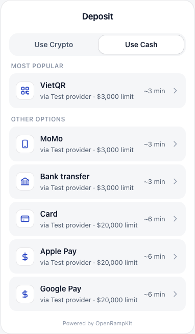
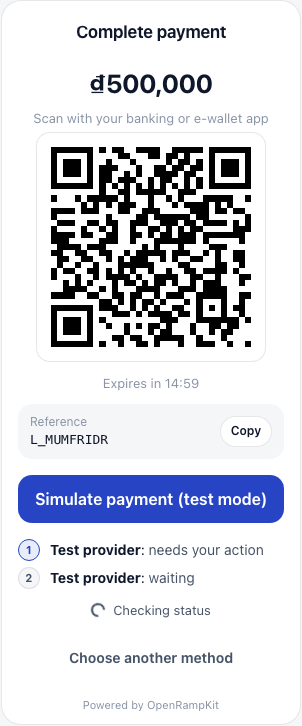
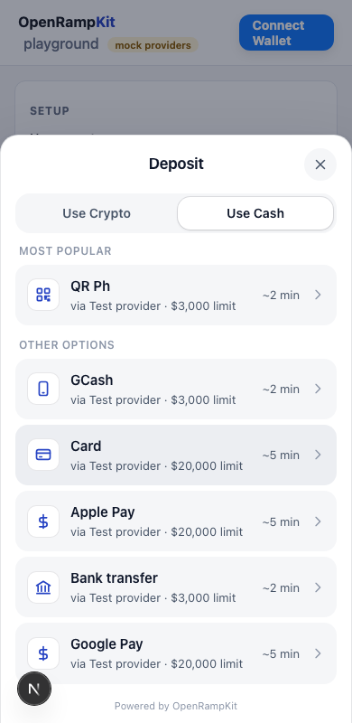
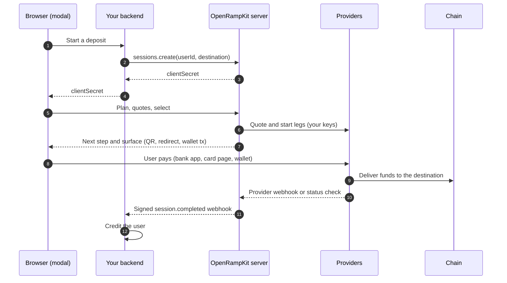
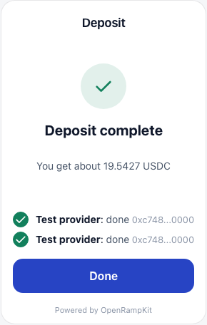
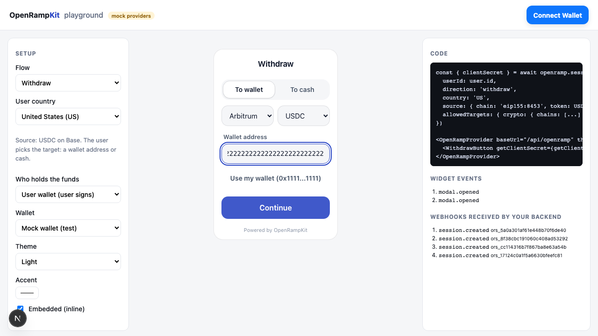
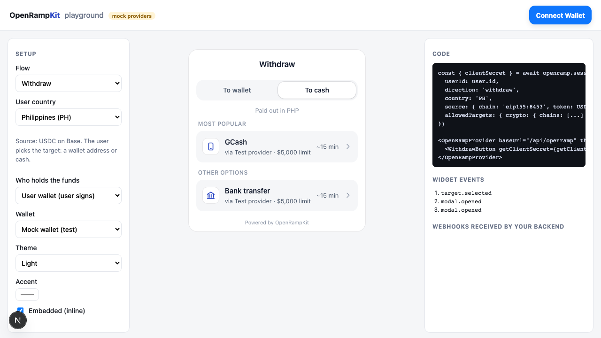

<div align="center">

# OpenRampKit

**The RainbowKit for onramps and deposits.**

Open-source, unified deposit infrastructure for crypto apps.<br>
Solving the onboarding chasm of getting billions of users onchain.

[](https://github.com/yosriady/openrampkit/actions/workflows/ci.yml)
[](LICENSE)
[](tsconfig.base.json)

**[Docs](https://openrampkit-getformo.vercel.app/)** · **[Live demo](https://openrampkit-getformo.vercel.app/playground/)** · **[Security](SECURITY.md)**

</div>

<table>
  <tr>
    <td align="center"><br><sub>Local methods first</sub></td>
    <td align="center"><br><sub>Pay by VietQR</sub></td>
    <td align="center"><br><sub>Pay from wallet</sub></td>
    <td align="center"><br><sub>Merchant QRIS, dark</sub></td>
    <td align="center"><br><sub>Phone sheet</sub></td>
  </tr>
</table>

OpenRampKit gives your app one deposit and withdraw modal, a server that you host, and provider adapters that anyone can write. Withdrawals are supported too. Local payment methods are first class: VietQR, QRIS, PromptPay, QR Ph, PayNow and GCash sit next to cards, Pix, UPI, SEPA Instant, Faster Payments, iDEAL, BLIK, SPEI, PSE, Interac and M-Pesa.

> [!NOTE]
> **Status: prototype.** The packages are not on npm yet (the first release will be `0.1.0`), and APIs will change. To try them today, see [Try it before the npm release](https://openrampkit-getformo.vercel.app/guide/installation#try-it-before-the-npm-release). The [live demo](https://openrampkit-getformo.vercel.app/playground/) uses mock providers and moves no real money.

## Two-minute tour

New here? These six steps show the whole project.

1. **Try the live demo.** Open the [playground](https://openrampkit-getformo.vercel.app/playground/). It runs the real server in your browser tab, with mock providers. You need no account and no key. Change **User country** to see the local methods of each market.
2. **Watch a deposit compare quotes.** With country **VN**, click **Use Cash**, then **VietQR**. Type an amount and click **Continue**. Several providers quote the same route, and the best one shows **Best price**. Click **Confirm**, then **Simulate payment**. The right panel shows the widget events and the signed `session.completed` webhook.
3. **See the onchain settlement.** `OpenRampSettlement` is live at [`0xBF66…7132` on Arbitrum Sepolia](https://arbitrum-sepolia.blockscout.com/address/0xBF66696115128B8f9f794780061348b4213A7132) (same address on Robinhood Chain Testnet and Tempo Testnet). This [`Settled` transaction](https://sepolia.arbiscan.io/tx/0x7e6a3848d92ea11ae833d05b9584f3f83481b9bb4f3ed849843b2ffffeea87ac) pays 25 test USDC into an ERC-4626 vault in one transaction. All links are in [contracts/deployments.md](contracts/deployments.md).
4. **Read the design.** The [architecture](https://openrampkit-getformo.vercel.app/concepts/architecture) page shows the components, the trust boundaries and the data model. The [flows](https://openrampkit-getformo.vercel.app/concepts/flows) page has a sequence diagram for each key flow: local QR, two-leg pathway, wallet payment, onchain settlement, withdraw, webhooks and MCP.
5. **Check the tests and CI.** [CI](https://github.com/yosriady/openrampkit/actions/workflows/ci.yml) runs typecheck, unit tests with coverage, a package smoke test, an Anvil chain test and Foundry tests on each push. Unit tests sit next to the code (`packages/*/src/*.test.ts`). Browser tests are in [examples/next-demo/e2e](examples/next-demo/e2e) and [examples/playground/e2e](examples/playground/e2e). Contract tests are in [contracts/test](contracts/test).
6. **Review the security model.** Read [SECURITY.md](SECURITY.md) for the threat model and controls, and the [security guide](https://openrampkit-getformo.vercel.app/guide/security) for what your app must do.

## Contents

- [Two-minute tour](#two-minute-tour)
- [Why](#why)
- [Features](#features)
- [Quick start](#quick-start)
- [How it works](#how-it-works)
- [Packages](#packages)
- [Adapters](#adapters)
- [Chains and payment methods](#chains-and-payment-methods)
- [Onchain settlement](#onchain-settlement)
- [Deploy](#deploy)
- [Development](#development)
- [Status and roadmap](#status-and-roadmap)
- [Contributing](#contributing), [Security](#security), [License](#license)

## Why

- **Most people cannot pay the way ramps expect.** In Southeast Asia and other markets, people pay with local QR codes and e-wallets, not cards. Global ramps are card first and cover few local methods.
- **Each provider is a separate integration.** To reach users in many countries, an app must add 5 to 10 providers. Each one has its own keys, KYC hand-off, webhooks, statuses and failure modes.
- **Hosted aggregators take control and a fee.** They hold the provider contracts, the data and the routing. You cannot add a provider that they do not support.

OpenRampKit is the open alternative. It is MIT licensed and self-hosted. You use your own provider keys. There is no platform fee.

## Features

**UI**
- `<openramp-modal>`: a web component (Lit, Shadow DOM) that works in any framework.
- Wrappers for React, Vue 3 (and Nuxt), Svelte 5 and 4 (and SvelteKit), and Solid (and SolidStart). All are SSR-safe.
- Modal, embedded and headless modes. Light, dark and auto themes, CSS variables and parts.
- Deposit and withdraw buttons: `DepositButton`, `WithdrawButton`, `openDeposit()`, `openWithdraw()`.

**Pathways and planner**
- A pathway has one or two legs. Example: VietQR at an onramp to USDC on Base, then a Relay bridge to a token on another chain.
- A pure planner builds every pathway that can reach the destination and groups them by payment method.
- The server quotes up to five pathways in parallel and ranks them. Each leg shows its quote, fee and status.
- Default method order per country puts local QR and e-wallet methods first.

**Server**
- One web-standard `Request -> Response` handler. It runs on Cloudflare Workers, Next.js, Node 20+, Bun and Deno.
- Holds provider secrets. Fixes the user, the destination and the amount limits when your backend creates the session.
- Receives provider webhooks. Sends signed webhooks (HMAC-SHA256) to your backend, with retries.
- A background `sweep()` retries webhooks, checks open payments after the user leaves, and expires idle sessions.
- Session stores: memory (dev), Cloudflare Durable Objects, Cloudflare KV, Redis, or your own.
- Signed, expiring pay links (`sessions.payLink()`) to a hosted page.

**Adapters**
- 10 provider adapters plus a mock adapter. Write your own with `createAdapter()` and test it with the conformance kit.
- Two wallet adapters: `wagmiWallet()` for EVM and `solanaWallet()` for Solana (Wallet Standard).

**Destinations and chains**
- Deposit to a token on any chain that an adapter supports: Ethereum, Base, Arbitrum, Optimism, Polygon, BNB Chain, Monad, HyperEVM, Tempo and Solana.
- Robinhood Chain and Arbitrum Sepolia for the settlement contract.
- Or deposit fiat into your own merchant account (Xendit), with no crypto in the flow.

**Onchain settlement**
- `OpenRampSettlement` settles each session once, onchain. It can run an allowlisted call bundle, for example an ERC-4626 vault deposit, in the same transaction.

**AI agents (MCP)**
- `@openrampkit/mcp` lets an agent create a deposit or payout session and send a pay link. A person pays. The agent waits for the result.

**Withdraw**
- To a wallet on any chain (Relay), or to cash (Swapped payouts: bank transfer, Skrill, Pix, Interac).
- User wallet custody, or app custody with your own treasury hook. Address checks, `allowedTargets` and `screenAddress` (fails closed).

**i18n**
- English by default. Override any string with `messages`. Optional built-in translations (vi, id, th, ms, fil) turn on only when your app sets `locale`.

**Accessibility**
- The modal is a `dialog` with `aria-modal`. It traps focus, closes on Escape, moves focus to each new screen and announces progress in a live region.
- CI runs axe checks, keyboard tests and locale tests in the browser.

**Security**
- The browser gets only a client secret. It cannot change the user, the destination or the amount limits.
- Provider webhooks are verified over the raw body. Start URLs are signed and expire. Body size limits, rate limits and timeouts are on by default. See [SECURITY.md](SECURITY.md).

## Quick start

This example uses Next.js and the mock adapter, so you need no provider account. See the full [Quick start (Next.js)](https://openrampkit-getformo.vercel.app/guide/quick-start-nextjs) guide.

### 1. Install

```bash
pnpm add @openrampkit/server @openrampkit/adapter-mock @openrampkit/react
```

The packages are not on npm yet. Until the first release, install local tarballs or run the examples. See [Try it before the npm release](https://openrampkit-getformo.vercel.app/guide/installation#try-it-before-the-npm-release).

### 2. Create the server

```ts
// lib/openramp.ts
import { createOpenRamp, memoryStore } from '@openrampkit/server'
import { mockAdapter } from '@openrampkit/adapter-mock'

export const openramp = createOpenRamp({
  secret: process.env.OPENRAMP_SECRET!, // 32+ characters
  baseUrl: `${process.env.PUBLIC_URL}/api/openramp`,
  adapters: [mockAdapter({ crypto: true, bridge: true })], // moves no money
  store: memoryStore(), // dev only; use durableObjectStore or redisStore in production
  webhooks: { url: `${process.env.PUBLIC_URL}/api/hooks`, secret: process.env.OPENRAMP_WEBHOOK_SECRET! },
})
```

```ts
// app/api/openramp/[...path]/route.ts
import { openramp } from '@/lib/openramp'

export const dynamic = 'force-dynamic'
export const { GET, POST, OPTIONS } = openramp.nextHandlers()
```

### 3. Create a session in your backend

Your backend decides who the user is and where the money goes. The browser never sends the destination.

```ts
// app/api/deposit-session/route.ts
import { openramp } from '@/lib/openramp'

export async function POST() {
  const user = await getUser() // your auth
  const session = await openramp.sessions.create({
    userId: user.id,
    country: 'VN',
    destination: {
      type: 'crypto',
      chain: 'eip155:8453', // Base
      token: '0x833589fcd6edb6e08f4c7c32d4f71b54bda02913', // USDC on Base
      symbol: 'USDC',
      decimals: 6,
      address: user.depositAddress,
    },
  })
  return Response.json(session) // { id, clientSecret, expiresAt }
}
```

### 4. Add the button

```tsx
'use client'
import { DepositButton, OpenRampProvider } from '@openrampkit/react'

const getClientSecret = () =>
  fetch('/api/deposit-session', { method: 'POST' }).then((r) => r.json()).then((j) => j.clientSecret)

export function Deposit() {
  return (
    <OpenRampProvider baseUrl="/api/openramp">
      <DepositButton getClientSecret={getClientSecret} onComplete={(s) => console.log('done', s.id)} />
    </OpenRampProvider>
  )
}
```

Without a framework, use the web component:

```ts
import { openDeposit } from '@openrampkit/web'

const { done } = openDeposit({ baseUrl: '/api/openramp', clientSecret: getClientSecret })
await done // resolves on COMPLETED
```

### 5. Credit the user from the webhook

Credit balances from the signed `session.completed` webhook, not from the browser.

```ts
// app/api/hooks/route.ts
import { openramp } from '@/lib/openramp'

export async function POST(req: Request) {
  const body = await req.text() // the raw body
  if (!(await openramp.webhooks.verify(req, body))) return new Response('bad signature', { status: 401 })
  const event = JSON.parse(body)
  if (event.type === 'session.completed') {
    // credit the user once per session
  }
  return new Response('ok')
}
```

Next steps: [Webhooks](https://openrampkit-getformo.vercel.app/guide/webhooks), [Withdrawals](https://openrampkit-getformo.vercel.app/guide/withdraw), [Theming](https://openrampkit-getformo.vercel.app/guide/theming), [Production checklist](https://openrampkit-getformo.vercel.app/deploy/checklist).

## How it works



- **The server fixes the destination.** The browser holds only a client secret for one session.
- **Server-driven steps.** The server tells the modal what to show next: a QR code, a redirect, a deposit address or a wallet transaction. The modal has no provider logic.
- **Errors are fields.** A failed quote or payment is an `OrkError` with a code, a safe message and a recovery hint.

Read more: [Architecture](https://openrampkit-getformo.vercel.app/concepts/architecture), [Pathways and legs](https://openrampkit-getformo.vercel.app/concepts/pathways), [Sessions and security](https://openrampkit-getformo.vercel.app/concepts/sessions), [Surfaces](https://openrampkit-getformo.vercel.app/concepts/surfaces).

## Packages

| Package | What it is |
|---|---|
| [`@openrampkit/core`](packages/core) | Types, exact money math, method and chain codes, region policy, flow table, pathway planner, ranking |
| [`@openrampkit/adapter`](packages/adapter) | `createAdapter()`, the conformance test kit, and the settlement helpers |
| [`@openrampkit/server`](packages/server) | `createOpenRamp()`: sessions, pathways, quotes, legs, webhooks, stores, sweep, pay links |
| [`@openrampkit/client`](packages/client) | Framework-free HTTP client, `DepositController`, `WithdrawController`, `createMockWallet` |
| [`@openrampkit/web`](packages/web) | `<openramp-modal>` web component, `openDeposit()`, `openWithdraw()`, themes, i18n |
| [`@openrampkit/react`](packages/react) | `OpenRampProvider`, `DepositButton`, `WithdrawButton`, `OpenRampEmbedded`, `useDepositController` |
| [`@openrampkit/vue`](packages/vue) | Vue 3 and Nuxt: `OpenRampProvider`, `provideOpenRamp`, buttons, `OpenRampEmbedded`, composables |
| [`@openrampkit/svelte`](packages/svelte) | Svelte 5 and 4, SvelteKit: `createOpenRamp`, stores, `use:depositButton` and other actions |
| [`@openrampkit/solid`](packages/solid) | Solid and SolidStart: `OpenRampProvider`, buttons, `OpenRampEmbedded`, primitives |
| [`@openrampkit/wagmi`](packages/wagmi) | `wagmiWallet()`: a wallet adapter for wagmi apps (EVM chains, including Tempo) |
| [`@openrampkit/solana`](packages/solana) | `solanaWallet()`: a wallet adapter for Solana (Wallet Standard, `@solana/kit`) |
| [`@openrampkit/mcp`](packages/mcp) | MCP server and `openrampkit-mcp` CLI for AI agents: deposit and payout sessions with pay links |
| `@openrampkit/adapter-*` | Provider adapters. See [Adapters](#adapters). |

## Adapters

Each provider is an adapter, like a wagmi connector. Pass the configured adapters to `createOpenRamp({ adapters })`.

| Id | Package | What it does | Status |
|---|---|---|---|
| `relay` | [`adapter-relay`](packages/adapters/relay) | Pay with wallet, transfer to a deposit address, bridge hop, withdraw to any address | Working. Live check with `pnpm live:relay` (moves no money) |
| `swapped` | [`adapter-swapped`](packages/adapters/swapped) | Card, Apple Pay, Google Pay, EUR bank transfer, SEA local methods (VietQR, MoMo, GCash and more), BLIK, SPEI, mobile money. Payouts for withdrawals | Working. Status polling TO VERIFY |
| `coinbase` | [`adapter-coinbase`](packages/adapters/coinbase) | Coinbase Onramp: card, Apple Pay, Google Pay, ACH (US) | Working. Some details TO VERIFY |
| `binance` | [`adapter-binance`](packages/adapters/binance) | Deposit from a Binance account balance (Binance Pay Onchain on-ramp) to any address | New. Needs Binance partner approval. Some details TO VERIFY |
| `transak` | [`adapter-transak`](packages/adapters/transak) | Card, Apple Pay, Google Pay, bank transfer, SEPA, UPI, Faster Payments, pay by bank, PSE | Working. Some details TO VERIFY |
| `moonpay` | [`adapter-moonpay`](packages/adapters/moonpay) | Card, Apple Pay, Google Pay, ACH, SEPA, Faster Payments, pay by bank (UK), Pix, PayPal, Venmo, Revolut Pay, Interac | New. Some details TO VERIFY |
| `stripe` | [`adapter-stripe`](packages/adapters/stripe) | Stripe Crypto Onramp: card, Apple Pay, Google Pay, ACH (US and EU) | New. Needs onramp approval |
| `xendit` | [`adapter-xendit`](packages/adapters/xendit) | QRIS, QR Ph, PromptPay, PayNow and e-wallets into your own merchant account | Working. Merchant destination only |
| `meld` | [`adapter-meld`](packages/adapters/meld) | Aggregator: card, UPI, Pix, SEPA, SEPA Instant, ACH, iDEAL, Bancontact, BLIK, PayID, SPEI, PSE, Khipu, M-Pesa, mobile money and more | New. In progress |
| `onramper` | [`adapter-onramper`](packages/adapters/onramper) | Aggregator: card, SEPA, SEPA Instant, ACH, Pix, UPI, IMPS, iDEAL, Bancontact, Faster Payments, SPEI, Khipu and more | New. In progress |
| `peer` | [`adapter-peer`](packages/adapters/peer) | P2P rails (zkp2p): Venmo, Cash App, Zelle, Chime, PayPal, Revolut, Wise | New. Opt-in (`enabled: true`); read the warning |
| `mock` | [`adapter-mock`](packages/adapters/mock) | Every surface type, for dev, tests and the demo | Mock. Moves no money. Refuses live sessions |

"TO VERIFY" means the source marks a provider detail as not yet checked against the live API. See the [adapter docs](https://openrampkit-getformo.vercel.app/adapters/) and [Writing an adapter](https://openrampkit-getformo.vercel.app/adapters/writing-an-adapter).

## Chains and payment methods

### Chains

Chains use CAIP-2 ids. `CHAINS` in `@openrampkit/core` holds the metadata. A chain that is not in the table still works when an adapter supports it.

| Chain | CAIP-2 id | Notes |
|---|---|---|
| Ethereum, Base, Optimism, Polygon | `eip155:1`, `eip155:8453`, `eip155:10`, `eip155:137` | Base is the default hop chain for two-leg pathways |
| Arbitrum | `eip155:42161` | Settlement contract target. Arbitrum Sepolia (`eip155:421614`) for tests |
| BNB Chain, Monad, HyperEVM | `eip155:56`, `eip155:143`, `eip155:999` | Chain metadata. Routes come from the adapters you configure |
| Tempo | `eip155:4217` | Stablecoin fees, no native gas token. Through Relay. See [Tempo](https://openrampkit-getformo.vercel.app/concepts/chains#tempo) |
| Robinhood Chain | `eip155:4663` | Arbitrum Orbit L2. Testnet `eip155:46630` is a settlement deploy target |
| Solana | `solana:5eykt4UsFv8P8NJdTREpY1vzqKqZKvdp` | Destination and source. See [Solana](https://openrampkit-getformo.vercel.app/guide/solana) |

### Payment methods

The method vocabulary is in `packages/core/src/codes.ts`. Which methods a user sees depends on the adapters you configure and the user's country.

| Market | Methods | Adapters |
|---|---|---|
| Vietnam | VietQR, MoMo, ZaloPay | Swapped; Xendit\* (MoMo, ZaloPay) |
| Indonesia | QRIS, GoPay, DANA, OVO, ShopeePay | Swapped (GoPay, DANA, OVO); Xendit\* (QRIS, DANA, OVO, ShopeePay) |
| Thailand | PromptPay, TrueMoney | Swapped (PromptPay); Xendit\* |
| Philippines | QR Ph, GCash, Maya, GrabPay | Swapped (GCash, Maya, GrabPay); Xendit\* |
| Malaysia | DuitNow QR, Touch 'n Go, GrabPay | Swapped (Touch 'n Go, GrabPay); Xendit\* (Touch 'n Go, GrabPay). DuitNow QR: mock only today |
| Singapore | PayNow | Xendit\* |
| Brazil | Pix | Swapped, MoonPay, Meld, Onramper |
| India | UPI, IMPS | Swapped, Transak, Meld, Onramper (UPI); Meld, Onramper (IMPS) |
| Euro countries | SEPA, SEPA Instant, pay by bank | Transak, MoonPay, Meld, Onramper (SEPA); Meld, Onramper (SEPA Instant); Transak, Meld, Onramper (pay by bank) |
| Netherlands, Belgium | iDEAL, Bancontact | Meld, Onramper |
| United Kingdom | Faster Payments, pay by bank | MoonPay, Transak, Meld, Onramper |
| Poland | BLIK | Meld, Swapped |
| United States | ACH, Venmo, Cash App, Zelle, Chime, PayPal | Coinbase, MoonPay, Stripe, Meld, Onramper (ACH); MoonPay (PayPal, Venmo); Peer, opt-in |
| Canada | Interac | MoonPay, Meld, Onramper |
| Mexico | SPEI | Meld, Onramper, Swapped |
| Colombia | PSE, Bancolombia | Transak, Meld (PSE); Onramper (Bancolombia) |
| Chile | Khipu | Meld, Onramper |
| Australia | PayID | Meld |
| Kenya and Africa | M-Pesa, mobile money | Meld (M-Pesa, mobile money); Swapped (mobile money in KE, ZM) |
| Global | Card, Apple Pay, Google Pay | Swapped, Coinbase, Transak, MoonPay, Stripe, Meld, Onramper |
| Crypto | Pay with wallet, Transfer crypto | Relay |

The [payment methods](https://openrampkit-getformo.vercel.app/concepts/payment-methods) page lists every method, its countries and the adapters that support it.

\* Xendit pays into your own merchant account (a [merchant fiat destination](https://openrampkit-getformo.vercel.app/guide/merchant-destination)). Swapped, Transak, Meld and Onramper also read a live catalog, so the exact list per country can change.

**Withdraw targets:** a wallet address on any chain that Relay supports, or cash through Swapped payouts (bank transfer in EUR, DKK and GBP, Skrill, Pix in Brazil, Interac in Canada).

## Onchain settlement

`OpenRampSettlement` is the onchain end point of a deposit session.

- A payer settles one session. The contract takes the amount, then pays the recipient or runs an allowlisted call bundle (for example an ERC-4626 deposit) in the same transaction.
- Each session id settles once. A second settlement reverts with `AlreadySettled`.
- The server verifies a payment by one receipt and one `Settled` event. It does not trust a transaction hash from the browser.
- An optional EIP-712 intent from the server binds the session, payer, token, recipient, minimum amount, calls and deadline.
- `Ownable2Step`, `Pausable`, no upgradeability, `ReentrancyGuardTransient`. Unit, fuzz and invariant tests in Foundry.
- Deploy targets: Arbitrum Sepolia, Arbitrum One, Robinhood Chain Testnet and Tempo Testnet.

**Live on testnets** (verified source, same address on each):

| Chain | Address |
|---|---|
| Arbitrum Sepolia | [`0xBF66696115128B8f9f794780061348b4213A7132`](https://arbitrum-sepolia.blockscout.com/address/0xBF66696115128B8f9f794780061348b4213A7132) |
| Robinhood Chain Testnet | [`0xBF66696115128B8f9f794780061348b4213A7132`](https://explorer.testnet.chain.robinhood.com/address/0xBF66696115128B8f9f794780061348b4213A7132) |
| Tempo Testnet | [`0xBF66696115128B8f9f794780061348b4213A7132`](https://explore.testnet.tempo.xyz/address/0xBF66696115128B8f9f794780061348b4213A7132) |

Demo settlements (a plain one, and one into a vault in the same transaction) and their transactions are in [contracts/deployments.md](contracts/deployments.md).

TypeScript helpers (`buildSettlementTxs`, `verifySettlement`, the ABI) are in `@openrampkit/adapter`. Today the Relay `wallet` leg can pay into the contract.

Read the [settlement docs](https://openrampkit-getformo.vercel.app/concepts/settlement) and [contracts/README.md](contracts/README.md).

## Deploy

| Host | How | Guide |
|---|---|---|
| Cloudflare Workers | A Worker with `durableObjectStore` (strongly consistent, no extra service). A Cron Trigger calls `sweep()` | [Cloudflare Workers](https://openrampkit-getformo.vercel.app/deploy/cloudflare-workers), [example](examples/cloudflare-worker) |
| Next.js / Vercel | `openramp.nextHandlers()` in a catch-all route. A Vercel Cron Job calls `sweep()` | [Next.js](https://openrampkit-getformo.vercel.app/deploy/nextjs), [example](examples/next-demo) |
| Node, Bun, Deno | `openramp.handle(request)` | [Node, Bun, Deno](https://openrampkit-getformo.vercel.app/deploy/node) |

Also read: [Session stores](https://openrampkit-getformo.vercel.app/deploy/stores) and the [Production checklist](https://openrampkit-getformo.vercel.app/deploy/checklist). Schedule the sweep every minute. Without it, nothing runs after the user leaves.

## Development

### Prerequisites

- Node.js 22 (CI uses 22; the packages need Node 20 or later)
- pnpm 11 (`packageManager: pnpm@11.10.0`)
- Foundry (optional): for `contracts/` and the Anvil chain tests

### Scripts

```bash
pnpm install
pnpm build            # build all packages
pnpm test             # unit and integration tests (Vitest)
pnpm typecheck        # typecheck all packages
pnpm coverage         # tests with coverage
pnpm smoke            # pack and install each package: ESM, CJS, SSR, TypeScript
pnpm docs:dev         # VitePress docs
pnpm playground:dev   # static playground, server in the browser: http://localhost:5175/playground/
pnpm dev:example      # Next.js demo (examples/next-demo)
pnpm test:chain       # real WALLET_TX on a local Anvil chain (needs Foundry)
pnpm live:relay       # live Relay API check with your key (moves no money)
pnpm testnet:settle   # one real settlement on Arbitrum Sepolia or Tempo Testnet (test tokens)
pnpm solana:settle    # one real payment on Solana devnet (create the key with pnpm solana:key)
pnpm --filter next-demo e2e   # Playwright browser tests
```

Contracts:

```bash
git submodule update --init --recursive
cd contracts && forge build && forge test
```

### Repo layout

```
.
├── packages/
│   ├── core/          types, money math, codes, planner
│   ├── adapter/       createAdapter, test kit, settlement helpers
│   ├── server/        createOpenRamp handler and stores
│   ├── client/        HTTP client and controllers
│   ├── web/           <openramp-modal> web component
│   ├── react/ vue/ svelte/ solid/   framework wrappers
│   ├── wagmi/ solana/ wallet adapters
│   ├── mcp/           MCP server for AI agents
│   └── adapters/      coinbase, meld, mock, moonpay, onramper, peer,
│                      relay, stripe, swapped, transak, xendit
├── contracts/         OpenRampSettlement (Foundry)
├── examples/
│   ├── next-demo/          Next.js app with Playwright tests
│   ├── cloudflare-worker/  Worker with a Durable Object store
│   ├── playground/         static demo, server in the browser
│   └── agent/              MCP agent example
├── docs/              VitePress docs and screenshots
└── scripts/           smoke test, Anvil, site build, live checks
```

<details>
<summary><b>More screenshots</b></summary>

| Use cash (Vietnam) | Quote | Complete | Transfer crypto |
|---|---|---|---|
|  |  |  |  |

| Card checkout | Merchant methods (dark) | Withdraw to wallet | Withdraw to cash |
|---|---|---|---|
|  |  |  |  |


</details>

## Status and roadmap

OpenRampKit is a prototype. Phases 0 to 3 of the [spec](docs/design/spec.md) are done, and parts of phase 5 (withdraw, more adapters, web component wrappers, Solana wallets, settlement calls) are in the repo.

Next:

- Publish the packages to npm (`0.x`) and harden the public alpha.
- Resolve the TO VERIFY provider details against live APIs and sandboxes.
- DuitNow QR and VietQR through a live provider.
- Fiat payouts to banks and e-wallets in Southeast Asia (Xendit).
- A React Native package, and more wallet adapters (Privy).
- Deploy `OpenRampSettlement` to mainnets behind a multisig, after an external review.

Design notes: [scope](docs/design/scope.md), [spec](docs/design/spec.md), [market landscape](docs/design/landscape.md).

## Contributing

Contributions are welcome, especially new adapters. Read [CONTRIBUTING.md](CONTRIBUTING.md) for the setup and the conventions, and pick a [good first issue](https://github.com/yosriady/openrampkit/labels/good%20first%20issue).

1. Read [Writing an adapter](https://openrampkit-getformo.vercel.app/adapters/writing-an-adapter).
2. Run the conformance kit from `@openrampkit/adapter/testing` against your adapter.
3. Run `pnpm build && pnpm typecheck && pnpm test` before you open a pull request.
4. Add a changeset with `pnpm changeset` when you change a published package.

## Security

OpenRampKit moves money. Do not open a public issue for a vulnerability. Use GitHub private vulnerability reporting. Read [SECURITY.md](SECURITY.md) for the threat model and the controls, and the [security guide](https://openrampkit-getformo.vercel.app/guide/security) for what your app must do.

## License

[MIT](LICENSE)
