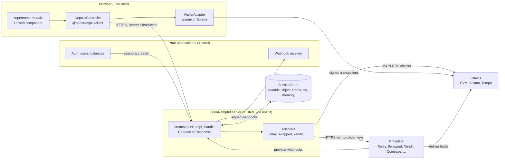
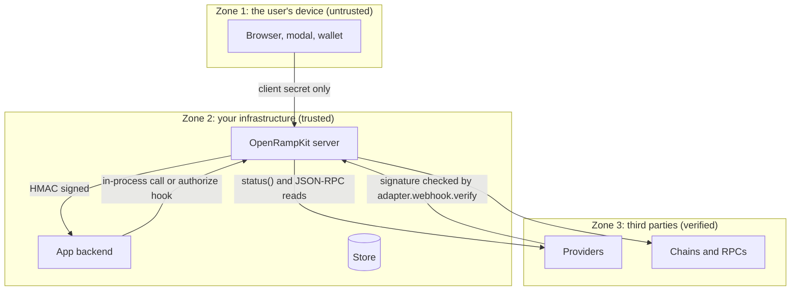
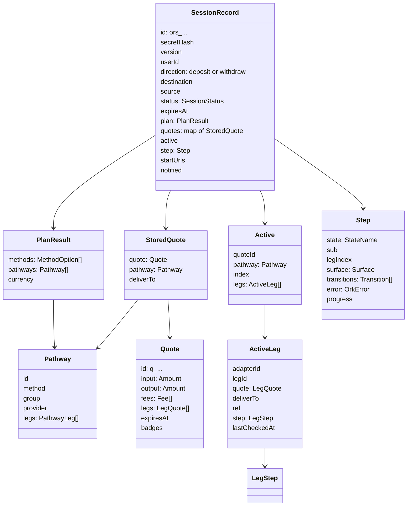
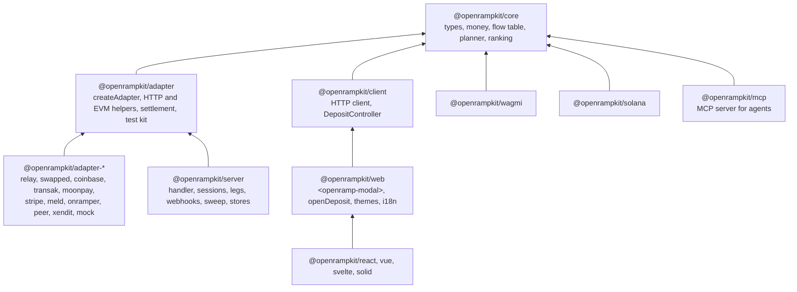
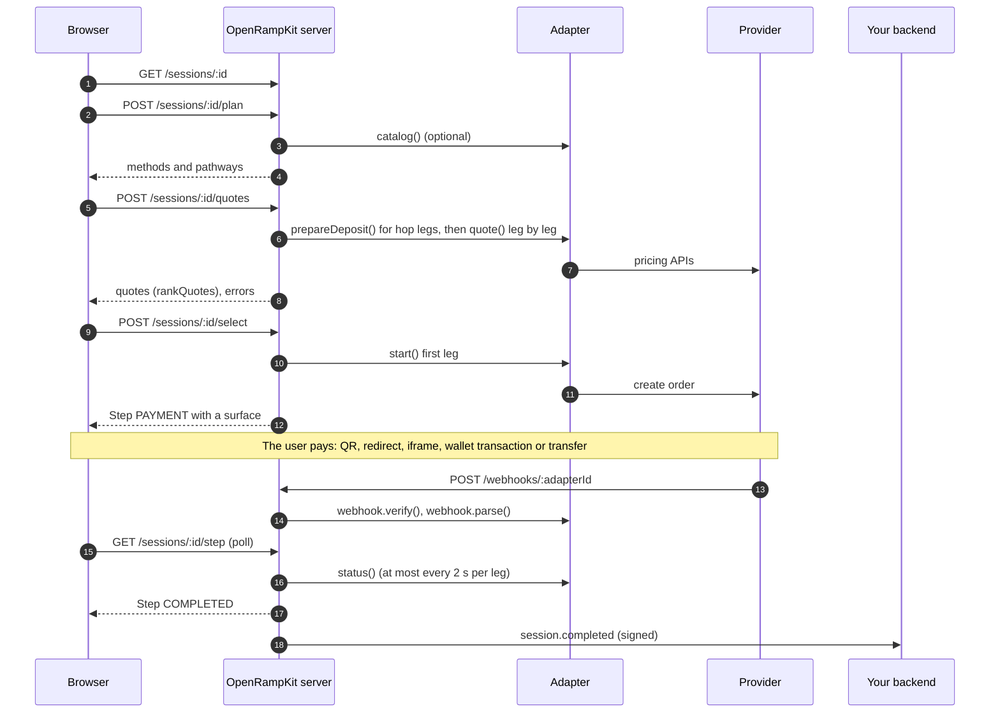

# Architecture

OpenRampKit has three runtime parts: the browser UI, your OpenRampKit server, and your app backend. Providers sit behind the server. An adapter wraps each provider. A session store holds the state. Chains are the last step for crypto money.

This page shows the components, the trust boundaries, what runs where, the data model and the package map. For the step-by-step flows, read [Flows](./flows.md).

## Components

- The **browser** renders the modal. It knows only the client secret of one session.
- **Your app backend** knows the user. It creates sessions and receives signed webhooks.
- The **OpenRampKit server** holds provider keys. It plans, quotes and runs legs. It is one web-standard handler.
- The **store** keeps sessions and small key-value data (webhook outbox, provider reference index, idempotency records, rate counters).
- **Providers** move the money. They send webhooks back to the server.
- **Chains** hold the final crypto. Some adapters read chains directly over JSON-RPC to verify a payment.

## Trust boundaries

| Boundary | What crosses it | How the server protects it |
|---|---|---|
| Browser to server | The client secret, method, amount, quote id, transition name | The secret is hashed in the store. The browser cannot set the user, the destination or the address. Routes check the body, the step, the rate and the deadline. |
| App backend to server | `CreateSessionInput` | `sessions.create()` runs in your code. Browser-created sessions need your `authorize` hook. |
| Server to app backend | Signed webhook events | HMAC-SHA256 over `id.timestamp.body` with `webhooks.secret`. Your backend checks it with `openramp.webhooks.verify()`. |
| Provider to server | Provider webhooks | Each adapter verifies the signature (`webhook.verify`) before `webhook.parse`. Unknown references are dropped. |
| Server to chain | JSON-RPC reads | The server never trusts a transaction hash from the browser alone. It checks the receipt, the amount, the recipient and the age, or the settlement receipt. |
| Provider page to modal | `postMessage` events from an IFRAME surface | The modal checks the exact origin and the source window. A message only triggers a status check. See [Iframe messages](./flows.md#iframe-message-protocol). |

The [Security](../guide/security.md) guide lists every check.

## What runs where

| Part | Runs in | Knows | Does not know |
|---|---|---|---|
| `web`, `client`, framework wrappers | The browser | The client secret, the plan, quotes, the current step | Provider keys, the user id, how to reach providers |
| `wagmi`, `solana` | The browser | The connected accounts. It signs transactions. | Sessions and providers |
| `server` | Your server or edge worker | Provider keys, sessions, the destination, adapters | Your users and balances |
| `adapter-*` | Inside the server | One provider's API | Other adapters, HTTP routing, storage layout |
| `core` | Everywhere | Types, the flow table, the planner, money math | Network, clock (planner), DOM |
| Your app backend | Your server | Users, auth, destinations, balances | Provider details |
| `mcp` | A separate process or your server | An app key or an in-process `OpenRamp` | Provider keys (in HTTP mode) |
| `OpenRampSettlement` | A chain | Settlement receipts per session id | Anything off chain |

## Data model

- **Session** (`SessionRecord` in the store, `PublicSession` on the wire). One deposit or one withdrawal for one user. It has a secret hash, a direction, a destination (deposit) or a source (withdraw), and a deadline. The server saves it with an optimistic version check.
- **Plan** (`PlanResult`). The methods and the pathways that the planner found for this session. The planner is pure. See [Pathways and legs](./pathways.md).
- **Pathway**. One or two legs, for example an onramp to USDC on Base, then a Relay bridge.
- **Quote**. The price of one pathway for one amount. It has one `LegQuote` per leg. The server keeps at most 20 quotes per session.
- **Active payment** (`active`). The pathway the user confirmed, the index of the current leg, and one `ActiveLeg` per leg. Each leg has a provider `ref` and the latest `LegStep` from its adapter.
- **Step**. What the browser shows now. The server builds it from the current leg. See [Flow state machine](./flow.md).
- **Result** (`PublicSession.result`). What the user paid and what arrived, with fees and transaction hashes.

Key-value records next to the sessions:

| Key | Value | Written by |
|---|---|---|
| `ref:{adapterId}:{ref}` | The session id that owns a provider reference (30 days) | `setLegStep` when a leg gets a `ref`. Provider webhooks use it to find the session. |
| `idem:{sessionId}:{route}:{key}` | The stored response of a request with an `Idempotency-Key` (24 hours) | `select` and `transitions/:name` |
| `rl:{sessionId}:{minute}` | A request counter | Routes that call provider APIs |
| `outbox`, `outbox:{eventId}` | Webhooks that failed and wait for a retry | `notify()`, then `sweep()` |
| `open-sessions` | Ids of sessions that are not final | `sessions.create()`, then `sweep()` |
| `a:{adapterId}:...` | Adapter data (per session, or shared) | Adapters, through `ctx.store` and `ctx.shared` |

## The packages

| Package | Use |
|---|---|
| `@openrampkit/core` | Shared types, decimal money math, error codes, region policy, the flow table, the planner and quote ranking |
| `@openrampkit/adapter` | `createAdapter()`, HTTP helpers, EVM helpers, OpenRampSettlement helpers, and the `/testing` conformance kit |
| `@openrampkit/adapter-*` | One package per provider. See [Adapters](../adapters/). |
| `@openrampkit/server` | `createOpenRamp()`: the HTTP handler, sessions, planning, legs, webhooks in and out, sweep, pay links, stores |
| `@openrampkit/client` | The HTTP client, `DepositController` (`RampController`), `createMockWallet` |
| `@openrampkit/web` | `<openramp-modal>`, `openDeposit()`, `openWithdraw()`, themes, locale catalogs, provider renderers |
| `@openrampkit/react`, `vue`, `svelte`, `solid` | Thin wrappers over `web` |
| `@openrampkit/wagmi` | `wagmiWallet()`: a `WalletAdapter` for EVM wallets |
| `@openrampkit/solana` | `solanaWallet()`: a `WalletAdapter` for Solana wallets (Wallet Standard) |
| `@openrampkit/mcp` | An MCP server so that AI agents can create deposits and payouts. See [Agents](../guide/agents.md). |
| `contracts/` | `OpenRampSettlement`, a Foundry project. See [On-chain settlement](./settlement.md). |

`core` is pure: no network, no clock in the planner, no DOM. The server, the client and the adapter test kit read the same flow table from it.

## One deposit, end to end

## Design choices

- **Web standards only.** The server uses `fetch`, `Request`, `Response` and WebCrypto. The same code runs on Cloudflare Workers, Vercel, Node 20+, Bun and Deno.
- **Server-driven UI.** The modal renders whatever `Step` the server returns. A new provider needs no UI release, as long as it uses a known [surface](./surfaces.md).
- **State in a store, not in memory.** Each request loads the session, changes it, and saves it with an optimistic version check. Any instance can serve any request. See [Session stores](../deploy/stores.md).
- **Adapters are data plus functions.** Static `LegSpec` declarations feed the planner. `quote`, `start`, `transition`, `status` and `webhook` run the leg.
- **The server is the source of truth.** A redirect return, an iframe message or a wallet hash only starts a status check. The outcome comes from the provider or the chain.

For the reasons behind these choices, read the [scope](../design/scope.md) and the [spec](../design/spec.md).
