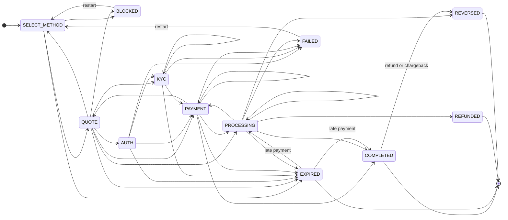
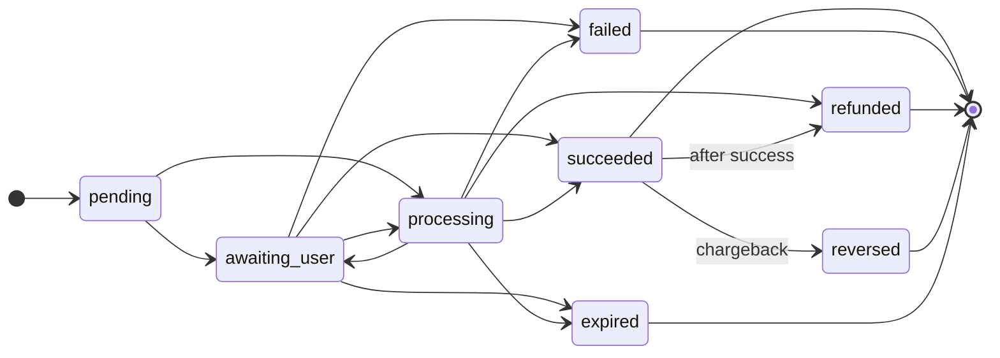

# Flow state machine

The server drives the flow. Every response carries the session's current `Step`. The modal renders the step and fires the transitions it allows.

## The Step

```ts
type Step = {
  sessionId: string
  state: StateName
  sub?: StepSub               // a finer label from a closed list, e.g. 'settling' or 'waiting_for_deposit'
  legIndex?: number           // which leg of the pathway is active
  surface?: Surface           // what to show: QR, redirect, deposit address, ...
  transitions: Transition[]   // what the user or the client may do next
  error?: OrkError
  progress?: { legs: Array<{ adapterId: string; legId: string; provider?: string; status: LegStatus; txHash?: string }> }
  expiresAt?: string
}
```

## Sub-states

`Step.sub` is a finer label inside `state`. It comes from a closed list of lowercase values, `STEP_SUBS` in `@openrampkit/core` (type `StepSub`):

| `sub` | Used in | Meaning |
|---|---|---|
| `kyc_details` | `KYC` | The user gives details in a form |
| `kyc_terms` | `KYC` | The user accepts the provider terms |
| `kyc_verify` | `KYC` | The user verifies identity at the provider |
| `kyc_review` | `KYC` | The provider reviews the identity |
| `card_details` | `PAYMENT` | The user gives card details |
| `bank_details` | `PAYMENT` | The user sends a bank transfer to the details shown |
| `payout_account` | `PAYMENT` | The user gives a payout account |
| `send_crypto` | `PAYMENT` | The user sends crypto |
| `waiting_for_deposit` | `PROCESSING` | The provider waits for a deposit |
| `ambiguous_deposit` | `PAYMENT`, `PROCESSING` | A deposit matches more than one session; an operator must check it |
| `confirming` | `PROCESSING` | A transaction waits for confirmation on chain |
| `bridging` | `PROCESSING` | The funds move between networks |
| `settling` | `PROCESSING` | The provider settles or pays out |
| `delayed` | `PROCESSING` | The provider reports a delay |
| `refunding` | `PROCESSING` | The provider refunds the payment |
| `processing` | `PROCESSING` | Any other provider work |

Rules:

- An adapter maps its provider statuses to this list. It puts the raw provider status in `LegStep.providerStatus`. The server writes each new raw status to the session timeline (`leg.provider_status`). The raw status never reaches the browser.
- The server drops a `sub` that is not in the list, and logs a warning.
- The web UI shows the label of `messages.stepSub[sub]` in the user's language. Without a known `sub`, it shows the state title.

## States

| State | Meaning | Terminal |
|---|---|---|
| `SELECT_METHOD` | No payment yet. The user picks a method, an amount and a quote. | No |
| `QUOTE` | A quote step inside a leg | No |
| `AUTH` | The provider needs the user to sign in | No |
| `KYC` | The provider needs identity checks | No |
| `PAYMENT` | The user must act: scan, pay, send, sign | No |
| `PROCESSING` | Paid; the provider or the chain is working | No |
| `COMPLETED` | Every leg succeeded | Yes |
| `FAILED` | A leg failed | Yes |
| `EXPIRED` | The session or the payment expired | Yes |
| `REFUNDED` | The provider refunded the payment | Yes |
| `BLOCKED` | Not allowed (policy or region) | Yes |

## The table as data

The legal moves live in one table in `@openrampkit/core`, `TRANSITION_TABLE`. The server, the client and the adapter test kit all read it. Terminality comes from this table, never from counting transitions.

| From | May move to |
|---|---|
| `SELECT_METHOD` | `QUOTE`, `BLOCKED`, `EXPIRED` |
| `QUOTE` | `SELECT_METHOD`, `AUTH`, `KYC`, `PAYMENT`, `PROCESSING`, `BLOCKED`, `EXPIRED` |
| `AUTH` | `KYC`, `PAYMENT`, `FAILED`, `EXPIRED` |
| `KYC` | `KYC`, `PAYMENT`, `FAILED`, `EXPIRED` |
| `PAYMENT` | `PAYMENT`, `PROCESSING`, `COMPLETED`, `FAILED`, `EXPIRED`, `QUOTE` |
| `PROCESSING` | `PROCESSING`, `PAYMENT`, `COMPLETED`, `FAILED`, `REFUNDED`, `EXPIRED` |
| `COMPLETED` | none |
| `FAILED` | `SELECT_METHOD` (try again) |
| `EXPIRED` | none |
| `REFUNDED` | none |
| `BLOCKED` | `SELECT_METHOD` |

Helpers: `isTerminal(state)`, `isLegalMove(from, to)`, `validateStep(step)`, `TABLE_VERSION` (currently `1`). `isLegalMove` also allows a move to the same state.

The same table as a diagram. `[*]` on the left is a new session. `[*]` on the right is a final state with no way out.



`FAILED` and `BLOCKED` are terminal, but the table lets them go back to `SELECT_METHOD`. The `restart` transition does this. In the table, `REFUNDED` and `REVERSED` have no way out. `EXPIRED` can go to `PROCESSING` or `COMPLETED` only when a payment arrives after the expiry (a webhook, or the sweep's [grace poll](../api/server.md#background-sweep)). `COMPLETED` can go to `REVERSED` only: the provider refunded or took back the payment after it completed (see [Refunds and chargebacks after success](./events.md#refunds-and-chargebacks-after-success)). The server's `restart` route is wider than the table: it accepts a restart after any final state other than `COMPLETED`, until the session deadline.

Who uses the table:

- The server and the client read terminality from it (`isTerminal`). A terminal step stops the poll, and the server refuses a new payment while a step is not terminal.
- The adapter test kit checks each `LegStep` with `validateStep`. For example, a terminal step must not have an AWAIT transition.
- The server does not reject a move that is not in the table. Adapters must return legal steps. The conformance kit helps you check this.

In practice, the server moves `SELECT_METHOD` straight to the first leg's state when `POST /select` starts the leg. `QUOTE` is for adapters that quote inside a leg.

### Leg status

Each leg has its own `LegStatus`. The server maps it to a state when a provider event arrives:



| Leg status | Session state | Final |
|---|---|---|
| `pending` | `PROCESSING` | No |
| `awaiting_user` | `PAYMENT` | No |
| `processing` | `PROCESSING` | No |
| `succeeded` | `COMPLETED` for the last leg, else `PROCESSING` while the next leg starts | Yes |
| `failed` | `FAILED` | Yes |
| `refunded` | `REFUNDED`, or `REVERSED` when the leg had succeeded | Yes |
| `reversed` | `REVERSED` | Yes |
| `expired` | `EXPIRED` | Yes |

The server enforces the order of leg statuses for provider events (webhooks and adapter routes). Each status has a rank (`LEG_STATUS_RANK`): `pending` 0, `awaiting_user` 1, `processing` 2, `succeeded`, `failed` and `expired` 3, `refunded` and `reversed` 4. An event can move a leg to the same status or to a status of a higher rank (`isLegalLegMove`). A final leg does not move, with one exception: a `succeeded` leg can become `refunded` or `reversed`. So a late `pending` event cannot move a `processing` leg back. The server logs the event, adds 1 to the `event.out_of_order` metric, and answers the provider with `200` (the event is ignored, not an error).

One move back can be allowed: from `processing` to `awaiting_user` with a new `surface`. For example, an offramp learns its deposit address from a webhook and now needs a `WALLET_TX`. A new surface can send the user's funds to a new place, so the server allows this move only when all of these are true:

- the leg's spec has the capability `surface_after_processing`,
- the surface kind is in the spec's `surfaces`,
- the leg has no transaction yet,
- the leg did not move back before (once per leg).

The timeline gets `leg.surface_after_processing`. No built-in adapter needs this move today.

A status check (`status()`) and a transition (`transition()`) also move a leg only forward. One more move back is allowed for them: a review step (`processing` in a `KYC` or `AUTH` state, for example a KYC review) can end with a step for the user (`awaiting_user`), before the leg has a transaction. A status check that would move a leg back is ignored. A transition that would do it answers `409`.

A session with a completed payment (`COMPLETED`, or `REVERSED` after it) refuses every browser change with `409`: plan, quotes, target, select and transitions, with the client secret or a pay link. An `EXPIRED` session moves on only when money arrives on the leg that waited at expiry, inside the grace window (`latePayments`).

When an event has an `eventId`, the server keeps the id in the session (the last 50 ids). An event with an id that the session already applied is ignored.

## Transitions

A step lists what may happen next:

```ts
type Transition =
  | { name: string; kind: 'SUBMIT'; label: string; inputs?: FieldSpec[] }        // a button, maybe with a form
  | { name: string; kind: 'AWAIT'; poll: PollSpec }                              // the client polls
  | { name: string; kind: 'SURFACE_RESULT'; expects: 'completed' | 'closed' | 'tx_hash' } // the surface reports back
```

- **SUBMIT**: the modal shows a button with `label`. For `FORM` and `OTP` surfaces, the first SUBMIT is the form's submit button. The mock adapter's "Simulate payment (test mode)" is a SUBMIT.
- **AWAIT**: the client polls `GET /sessions/:id/step`. The delay starts at `intervalMs`, grows by `backoff` per attempt up to `maxIntervalMs`, and stops after `giveUpAfterMs`.
- **SURFACE_RESULT**: the surface reports an outcome. For `WALLET_TX` with `expects: 'tx_hash'`, the controller sends the transactions with the wallet and fires the transition with `{ txHash }`. For `REDIRECT` with `expects: 'completed'`, the modal shows a "Continue" button after the user opened the checkout.

The client fires SUBMIT and SURFACE_RESULT with `POST /sessions/:id/transitions/:name`. The server refuses a name that is not in the current step, and refuses AWAIT names.

One name is special: `restart`. It leaves the current payment and goes back to `SELECT_METHOD`. It is allowed before payment starts, while the step is `PAYMENT`, and after a terminal state other than `COMPLETED`. The modal's "Choose another method" button on a `PAYMENT` step fires it, and so does `DepositController.back()` on a `PAYMENT` step. The server keeps the left payment as an earlier attempt, because the user may have paid it already. A late provider event for it still applies: the session completes with that payment, or the server sends `session.late_payment` when another payment is in progress or complete. Only a payment that is under way or arrived (`processing` or `succeeded`) makes an earlier attempt the payment again. A refund of an earlier attempt that never succeeded changes only that attempt. The server checks the output of that payment against its quote, as for any other leg.

## Legs and the session step

Adapters return a `LegStep` for their leg. The server wraps it into the session's `Step`:

- A leg's `status` (`pending`, `awaiting_user`, `processing`, `succeeded`, `failed`, `refunded`, `expired`, `reversed`) is tracked per leg in `progress`.
- When a leg succeeds and it is not the last one, the server starts the next leg at once. The session shows `PROCESSING` meanwhile.
- When every leg succeeded, the step is `COMPLETED`.
- A provider event (webhook) maps a leg status to a state: `awaiting_user` to `PAYMENT`, `pending` and `processing` to `PROCESSING`, `succeeded` to `COMPLETED`, and so on. The current surface stays until the leg ends.

The session's `status` follows the step: `open` (no active payment), `processing`, `completed`, `failed` (`FAILED` or `BLOCKED`), `expired`, `refunded`, `reversed`.

## Errors as fields

Errors do not end the flow with an exception. They travel as fields:

- `Step.error` on a failed step, with a recovery hint.
- `errors` next to `quotes`, one per pathway that could not be quoted.
- `MethodOption.reason` on an unavailable method.
- HTTP error responses as `{ "error": OrkError }`.

```ts
type OrkError = {
  code: OrkErrorCode
  message: string      // safe to show to the user
  retryable: boolean
  recovery?: 'requote' | 'retry_payment' | 'choose_other' | 'contact_support'
  legId?: string
}
```

| Code | Default message | Retryable |
|---|---|---|
| `REGION_UNSUPPORTED` | This method is not available in your region. | No |
| `AMOUNT_TOO_LOW` | The amount is below the minimum for this method. | No |
| `AMOUNT_TOO_HIGH` | The amount is above the maximum for this method. | No |
| `QUOTE_EXPIRED` | The quote expired. Get a new quote to continue. | Yes |
| `NO_QUOTES` | No provider can serve this amount right now. Try another method or amount. | Yes |
| `PROVIDER_DECLINED` | The provider declined this payment. Try another method. | No |
| `KYC_REJECTED` | The provider could not verify your identity. | No |
| `PAYMENT_FAILED` | The payment did not go through. You can try again. | Yes |
| `PAYMENT_REVERSED` | The provider refunded or reversed this payment after it completed. | No |
| `DELIVERY_FAILED` | The funds could not be delivered. Contact support. | No |
| `RATE_LIMITED` | Too many requests. Wait a moment and try again. | Yes |
| `PROVIDER_UNAVAILABLE` | The provider is not available right now. | Yes. A provider that refuses our credentials (HTTP 401 or 403) gives a setup error: "{Provider} is not set up for this app yet. Try another method.", not retryable, recovery `choose_other`. |
| `CLIENT_UPGRADE_REQUIRED` | Update the app to use this method. | No |
| `SESSION_EXPIRED` | This session expired. Start a new deposit. | No |
| `UNAUTHORIZED` | This session is not valid. | No |
| `CONFLICT` | The session changed at the same time. Try again. | Yes |
| `ADDRESS_REJECTED` | This address cannot receive withdrawals. Use another address. | No |
| `TARGET_NOT_ALLOWED` | This app does not allow withdrawals to this target. | No |
| `TARGET_LOCKED` | The app set where these funds go. You cannot change it. | No |
| `BAD_REQUEST` | The request is not valid. | No |
| `NOT_FOUND` | Not found. | No |
| `INTERNAL` | Something went wrong on our side. | Yes |

Adapters may add their own codes. Build errors with `orkError(code, overrides)`, and throw them across boundaries as `new OrkException(error, httpStatus)`.

## The client side

`DepositController` in `@openrampkit/client` turns the steps into screens: `loading`, `target` (withdraw only), `methods`, `amount`, `quotes`, `step`, `result`, `error`. See [API: @openrampkit/client](../api/client.md).


