# Flows

This page shows the key flows as sequence diagrams. Each diagram uses the real route names, function names, event names and states from the source. For the parts and the trust boundaries, read [Architecture](./architecture.md). For the states, read [Flow state machine](./flow.md).

Names in the diagrams:

- **Browser**: `<openramp-modal>` and `DepositController` from `@openrampkit/web` and `@openrampkit/client`.
- **Server**: the handler from `createOpenRamp()` in `@openrampkit/server`. All routes are relative to your `baseUrl`.
- **Store**: your `SessionStore` (Durable Object, Redis, Cloudflare KV or memory).
- **Adapter**: one adapter package, for example `@openrampkit/adapter-relay`.
- **App**: your app backend.

## Session creation

Your backend creates the session. The browser gets only the client secret.

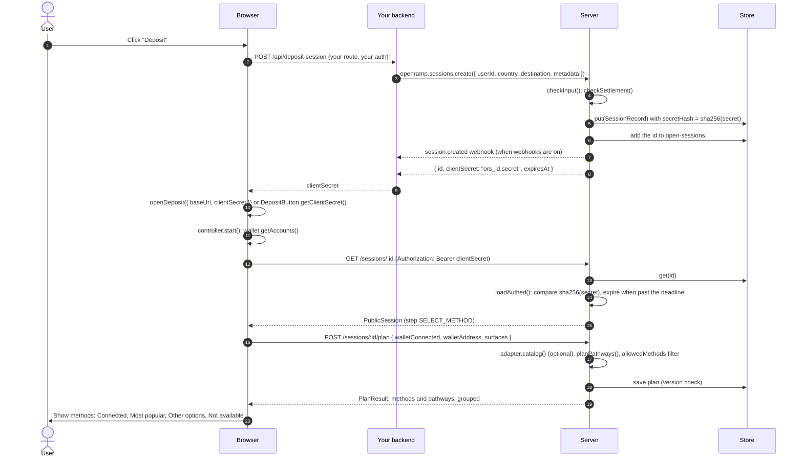

`sessions.create()` runs in your backend. It does not go over HTTP.

Optional: the browser can create the session itself, through your `authorize` hook.

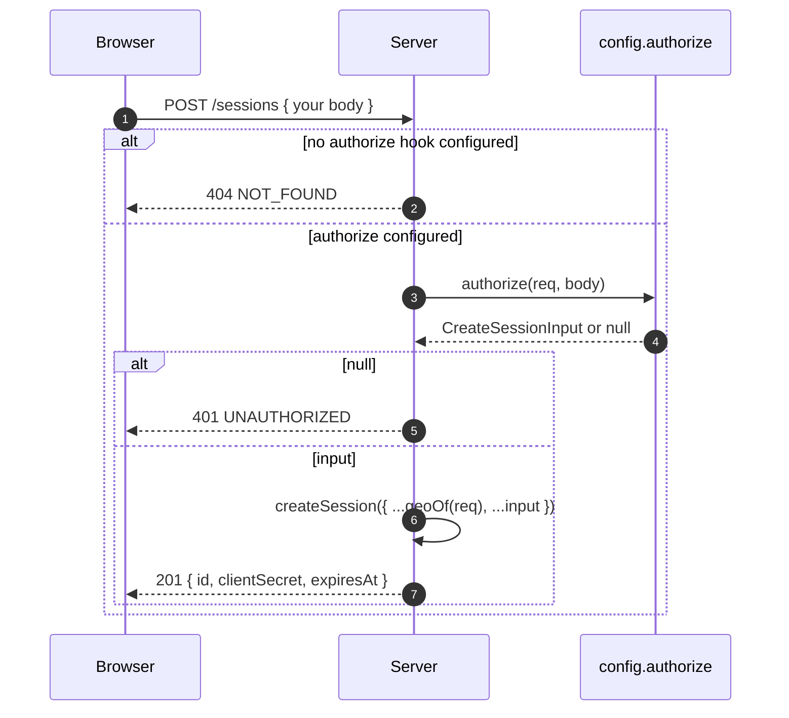

See [Sessions and security](./sessions.md).

## Fiat onramp with REDIRECT or IFRAME

A card or bank payment at a provider such as Coinbase, Transak, MoonPay or Swapped. The provider page opens in a popup (REDIRECT) or inside the modal (IFRAME).

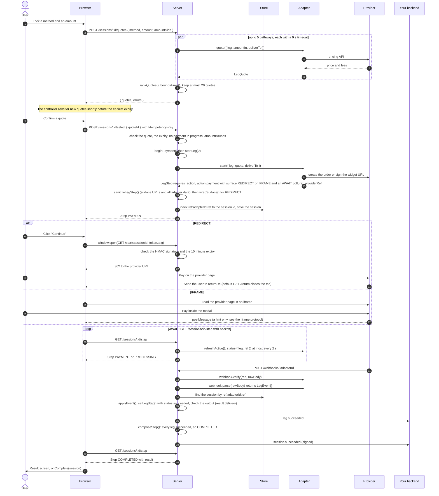

Notes:

- The browser never sees the provider URL before the user clicks. The start URL is on your own origin, so the popup opens inside the click handler.
- A provider event keeps the current surface until the leg ends. A webhook that arrives twice has no effect: `applyEvent()` ignores a leg that is already final.
- `applyEvent()` retries up to 3 times when a save meets a version conflict.

## Local QR payment

A QR rail such as QRIS, QR Ph, PromptPay or PayNow. The Xendit adapter returns a `QR` surface. The destination is your own merchant account. See [Merchant fiat destination](../guide/merchant-destination.md).

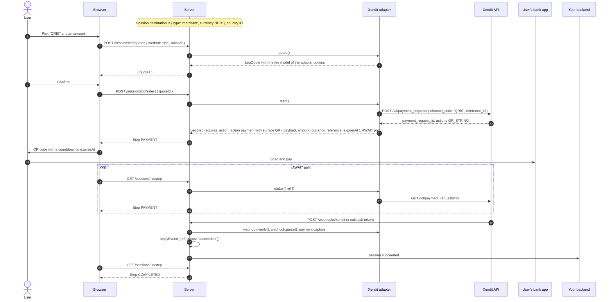

Other local rails:

- **VietQR, MoMo, GCash and other Swapped methods.** The Swapped adapter shows the Swapped widget in an `IFRAME` surface. The widget shows the QR code. The flow is the [fiat onramp flow](#fiat-onramp-with-redirect-or-iframe). Swapped sends order notifications to `POST /webhooks/swapped`.
- **E-wallets at Xendit.** Xendit can return a `WEB_URL` (a `REDIRECT` surface) or a `DEEPLINK_URL` (a `DEEPLINK` surface) in place of `QR_STRING`.
- **Tests and demos.** The mock adapter returns QR surfaces with no provider.

## Two-leg pathway: onramp, then Relay bridge

The user pays fiat at an onramp. The onramp buys a hop asset (USDC on Base, by default). A Relay bridge leg moves it to the destination chain and token.

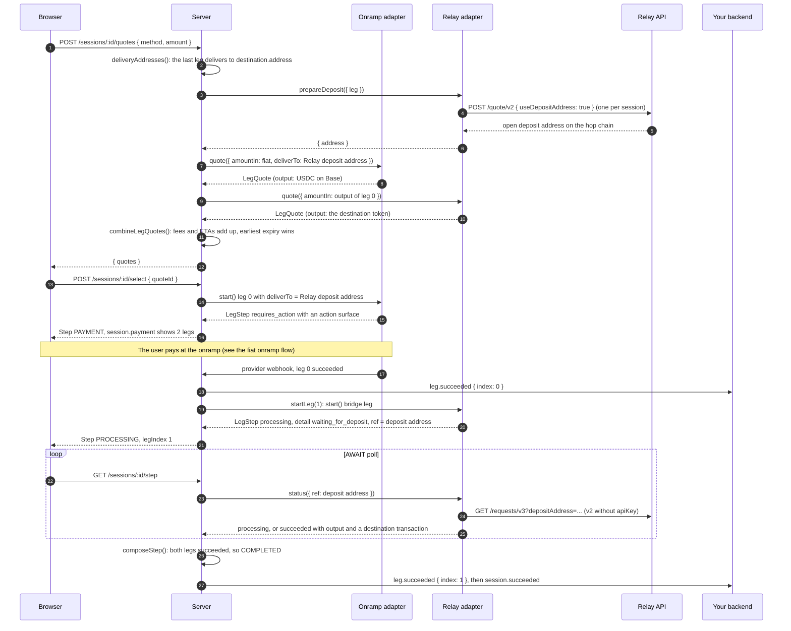

Notes:

- The Relay bridge leg has no webhook. The server learns the result from `status()`, from the browser poll or from the [background sweep](#background-sweep-and-session-expiry).
- The planner builds hops with `policy.hopPreference`. See [Pathways and legs](./pathways.md#hops).
- An exact output amount (`amountSide: 'destination'`) works on one-leg pathways only.

## Crypto transfer to a deposit address

The user sends crypto from any wallet or exchange. The Relay `transfer` leg shows a `DEPOSIT_ADDRESS` surface.

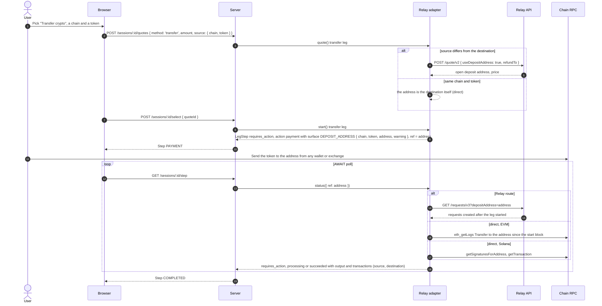

On Solana, each signature counts for one session only. Relay refunds a failed deposit-address request to the sender, when `refundTo` is `'origin'` (the default).

## Crypto payment from a connected wallet

The user pays from a wallet that the modal knows (`wagmiWallet()` or `solanaWallet()`). The Relay `wallet` leg shows a `WALLET_TX` surface.

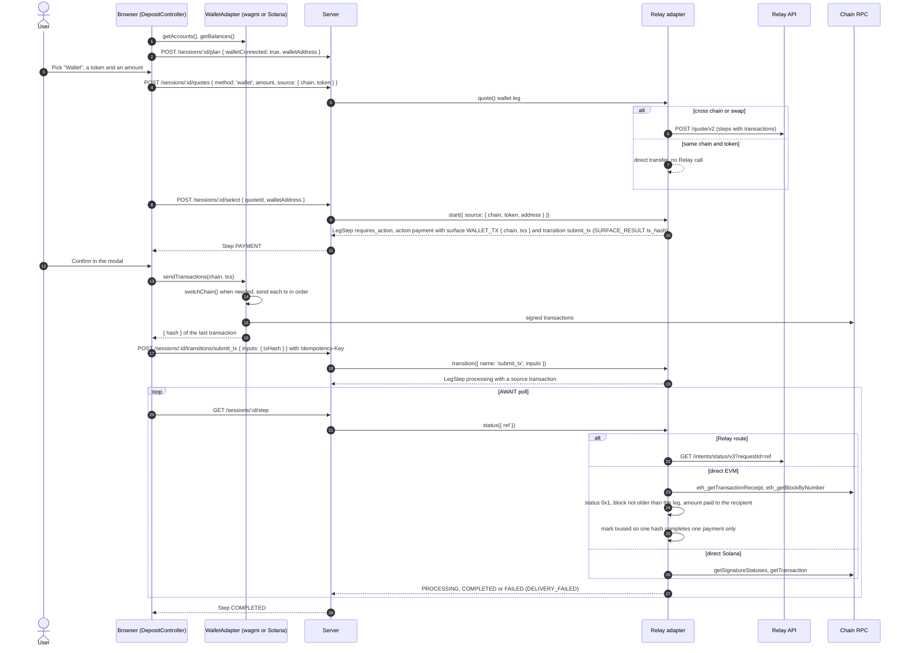

The server does not trust the hash from the browser. A direct payment counts only after the on-chain checks pass. See [Security](../guide/security.md#same-chain-payments-relay).

## On-chain settlement

The destination has `settlement: { contract }`, and maybe `calls`. The Relay `wallet` leg pays through `OpenRampSettlement` on the destination chain. See [On-chain settlement](./settlement.md).

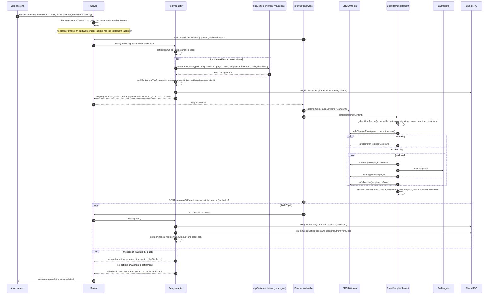

The server verifies by session id. A transaction hash from the browser is not enough. Without an intent signer, another wallet can settle the session id first with other values. Then the receipt does not match, and the leg fails.

## Withdraw

A withdraw session sends a `source` asset out. The user picks the target. The funds leave with a `WALLET_TX`: the user's wallet signs it (`custody: 'user_wallet'`), or your treasury hook sends it (`custody: 'app'`). See [Withdrawals](../guide/withdraw.md).

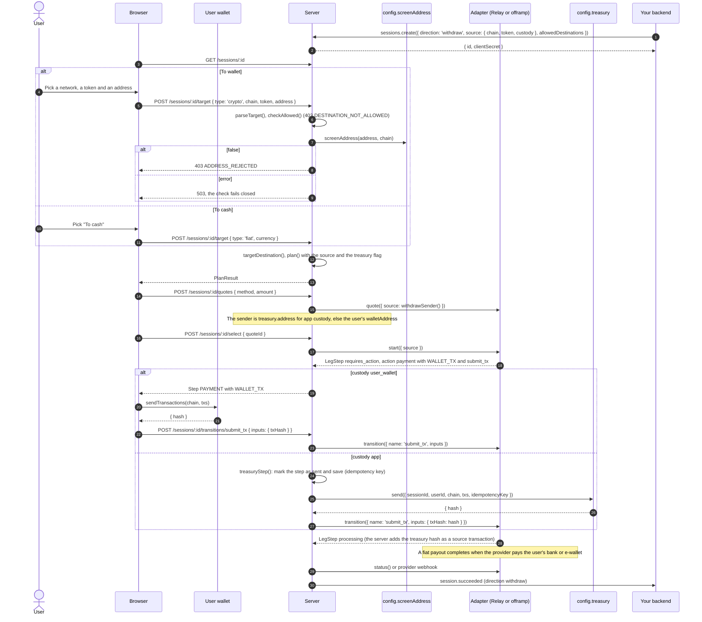

For a fiat payout at an offramp (for example Swapped), the provider first shows its own page in an `IFRAME` for the payout details. Then a provider event carries a new `WALLET_TX` surface that pays the provider's deposit address.

A failed withdrawal attempt sends `session.payment_failed`, and the user can try again. A final failure sends `session.failed`. When the treasury hook throws `TreasuryRefusedError`, the leg fails with `PAYMENT_FAILED` and the user can try again. Any other error from the hook makes the failure final, because the funds may have left. The server never sends again for that step.

## Webhooks to your backend

The server writes each event into the session record (the outbox) in the same save as the change. It sends the event only after that save succeeds. A failed delivery stays in the outbox, and the sweep retries it.

```mermaid
sequenceDiagram
  autonumber
  participant S as Server
  participant St as Store
  participant App as Your backend
  participant Sw as sweep()
  S->>S: notify(rec, type, extra)
  alt the key type plus extra is in rec.notified
    S->>S: skip: each event goes out once per session
  else new
    S->>S: rec.notified.push(key), id = evt_ + sha256(sessionId, key)
    S->>S: rec.outbox.push({ id, body, attempts: 0 })
  end
  S->>St: queue.push(outbox, sessionId, now + 30 s)
  S->>St: put(rec, version): the change and its events in one write
  alt 409 conflict
    S->>S: nothing is sent; a retry makes the same event ids
  else saved
    S->>App: POST webhooks.url with headers webhook-id, webhook-timestamp, webhook-signature
    Note over S,App: webhook-signature = "v1," + base64 HMAC-SHA256(secret, id.timestamp.body), timeout 4 s
    App->>App: openramp.webhooks.verify(req, rawBody), 300 s tolerance
    App->>App: dedupe by event id or session id, then credit
    S->>St: put(rec, version): remove the sent events, or attempts + 1
  end
  loop every sweep
    Sw->>St: queue.claim(outbox, limit, lease 10 min)
    Sw->>St: get(sessionId), events where nextAt has passed
    Sw->>App: POST the same body with the same event id
    alt 2xx
      Sw->>St: remove the event
    else fails, inside retryHours (default 24 h)
      Sw->>St: attempts + 1, nextAt = now + backoff (30 s doubling, max 2 h)
    else fails, retryHours passed (or maxAttempts reached)
      Sw->>St: keep it as a dead letter (deadAt) and log an error
    end
    Sw->>St: queue.ack(sessionId) when no event is left, else queue.push(sessionId, next due time)
  end
```

Delivery is at least once. A retry, or a lease that ends during a slow sweep, can send one event twice, and a repeat has the same event id. Credit the user once per event id or session id. See [Webhooks to your backend](../guide/webhooks.md).

## Background sweep and session expiry

Run `openramp.sweep()` from a cron job, or call `POST /tasks/sweep` with `tasksToken`. It keeps sessions moving after the user closes the tab.

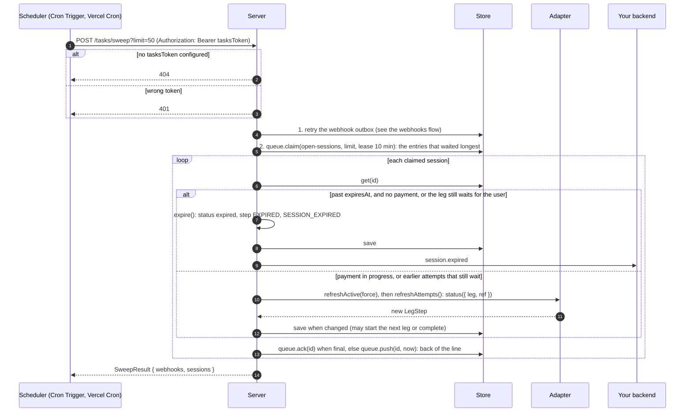

Other expiry paths:

- `loadAuthed()` expires a `requires_payment_method` session (no payment in progress, also after a failed attempt) on the next browser request after the deadline, and sends `session.expired`.
- After the deadline, `plan`, `target`, `quotes`, `select` and the `restart` transition answer `410 SESSION_EXPIRED`. A payment in progress can still finish.
- A leg can end as `expired`, for example a QR code that nobody paid. Then the step is `EXPIRED`.

## AI agent via MCP

`@openrampkit/mcp` lets an agent create a deposit, send a pay link to a person, and wait for the result. See [Agents (MCP)](../guide/agents.md).

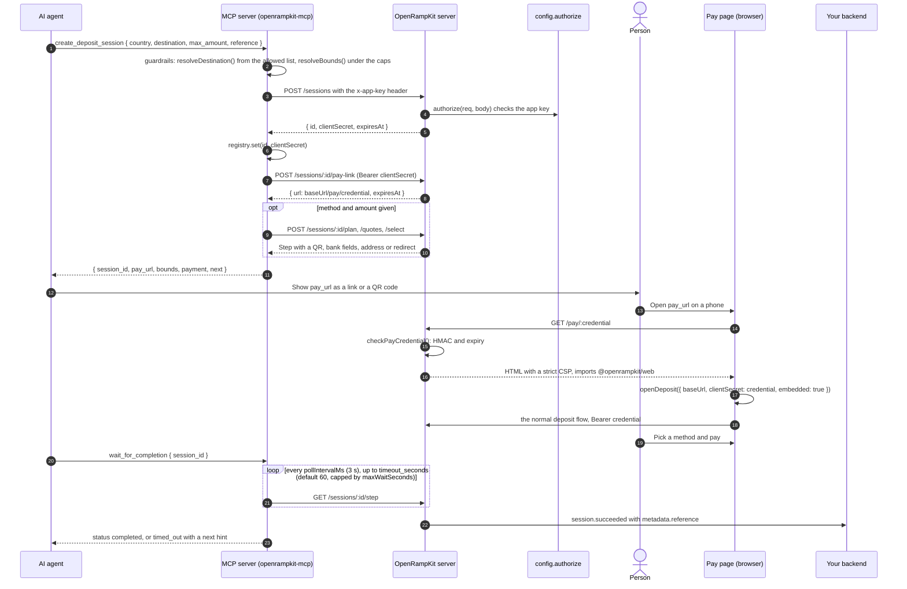

In-process mode (`connection: { openramp }`) skips HTTP: the MCP server calls `openramp.sessions.create()` and `openramp.handle()` directly. A pay link cannot make another pay link.

## Iframe message protocol

A provider page inside an `IFRAME` surface can post messages to the modal. The modal treats them as hints. The server status decides the outcome.

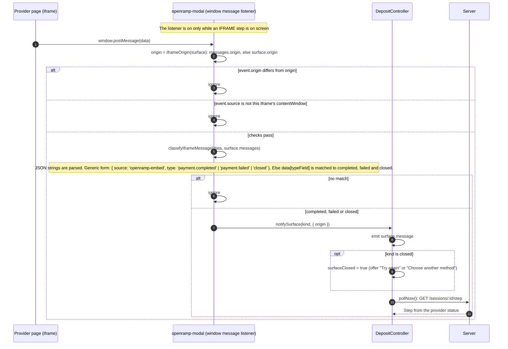

The server also checks the surface before the browser sees it: an `IFRAME` needs an `https:` `url` and `origin` (`http:` in test mode too). `PROVIDER_SDK` renderers (for example `stripeOnrampRenderer()`) follow the same rule: their `completed()` and `failed()` callbacks only start a status check.
