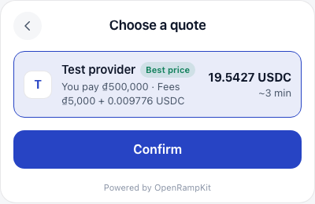

# Pathways and legs

A **pathway** is a way to move money from the user to the destination. It has one or two **legs**. Each leg is run by one adapter.

Examples:

| Pathway | Legs |
|---|---|
| Card to USDC on Base | `swapped.creditcard` (card -> USDC on Base) |
| VietQR to a token on Monad | `swapped.vietqr` (VND -> USDC on Base), then `relay.bridge` (USDC on Base -> token on Monad) |
| QRIS to your merchant account | `xendit.id-qris` (IDR -> your IDR balance) |
| Pay from a wallet | `relay.wallet` (any token in the wallet -> destination token) |
| Withdraw USDC on Base to an Arbitrum address | `relay.wallet` (USDC on Base -> USDC at the address on Arbitrum) |
| Withdraw USDC to a bank account in EUR | `swapped.sell-bank-transfer` (USDC -> EUR in the user's account) |

## Assets, locations and endpoints

The planner matches legs by **endpoints**. An endpoint is an asset at a location.

```ts
type Asset =
  | { kind: 'fiat'; currency: string }                                   // ISO 4217, e.g. 'VND'
  | { kind: 'crypto'; chain: string; token: string; symbol?: string; decimals?: number }
                                                                          // CAIP-2 chain, token address or 'native'
type Location =
  | { kind: 'user_wallet' }        // a wallet the user controls
  | { kind: 'user_account' }       // the user's bank, card or e-wallet
  | { kind: 'merchant_account'; accountRef?: string }
  | { kind: 'address'; address: string }

type Endpoint = { asset: Asset; location: Location }
```

Money values are decimal strings everywhere (`'12.5'`), never floats. Chains are CAIP-2 ids (`eip155:8453` is Base). Countries are ISO 3166-1 alpha-2 (`VN`).

## Destination

For a deposit, your backend sets the destination when it creates the session. For a withdrawal, the user picks it (the target), and the server stores it as the destination.

```ts
type Destination =
  | { type: 'crypto'; chain: string; token: string; address: string; symbol?: string; decimals?: number;
      calls?: ContractCall[]; settlement?: { contract: string } }
  | { type: 'merchant'; currency: string; accountRef?: string }
  | { type: 'fiat'; currency: string } // withdraw to cash
```

The planner turns it into the target endpoint:

- crypto: `{ asset: { kind: 'crypto', chain, token }, location: { kind: 'address', address } }`
- merchant: `{ asset: { kind: 'fiat', currency }, location: { kind: 'merchant_account' } }`
- fiat: `{ asset: { kind: 'fiat', currency }, location: { kind: 'user_account' } }`

`settlement` sends the payment through an on-chain settlement contract, and `calls` runs contract calls after delivery (for example a vault deposit). `calls` needs `settlement`. See [On-chain settlement](./settlement.md).

## Leg specs

Each adapter declares its legs as data. The planner reads only these declarations.

```ts
type LegSpec = {
  id: string                    // unique within the adapter
  kind: 'fiat_onramp' | 'fiat_payin' | 'wallet_transfer' | 'bridge_swap'
      | 'crypto_withdraw' | 'crypto_offramp' | 'fiat_payout'
  methods?: string[]            // user-facing methods, e.g. ['card', 'apple_pay'] or ['vietqr']
  from: EndpointMatcher         // what it takes
  to: EndpointMatcher           // what it delivers
  regions: { allow: string[]; deny: string[] }
  limits?: { min?: string; max?: string; currency: string }  // a hint; quotes carry exact limits
  eta: { min: number; max: number }                          // seconds
  surfaces: SurfaceKind[]
  requires?: Array<'provider_account' | 'provider_kyc' | 'wallet' | 'otp'>
  capabilities?: Array<'webhooks' | 'polling' | 'refunds' | 'exact_output' | 'saved_methods' | 'settlement'>
}

type EndpointMatcher = {
  asset:
    | { kind: 'fiat'; currencies: string[] | '*' }
    | { kind: 'crypto'; chains: Record<string, string[] | '*'> | '*' }  // chain -> lowercase token addresses
  location: Array<'user_wallet' | 'user_account' | 'merchant_account' | 'address'>
}
```

An adapter may also have a live `catalog()`. The server calls it at plan time with the user's country and currency, and uses the returned legs instead of the static ones. If the catalog fails, the server logs a warning and falls back to the static legs.

## The planner algorithm

`planPathways(input)` in `@openrampkit/core` is a pure function. The server calls it on `POST /sessions/:id/plan` (and on `POST /sessions/:id/target` for a withdrawal). This section describes deposits. Withdrawals use a simpler rule: see [Withdraw planning](#withdraw-planning).

1. **Currency.** For a merchant or fiat destination, the currency is the destination's currency. Otherwise it is the local currency of the user's country (`currencyForCountry`), or USD when the country is unknown.
2. **Sources.** The user can start from two places: fiat in `user_account` (in that currency), or any crypto in `user_wallet`.
3. **First legs.** Every leg whose `from` matches a source is a candidate first leg.
4. **One-leg pathways.** If the first leg's `to` matches the destination endpoint, it is a one-leg pathway, once per method.
5. **Two-leg pathways.** Otherwise, and only for crypto destinations when `maxLegs` is 2, the planner looks for a **hop**:
   - It lists the concrete crypto assets the first leg can deliver (it skips legs whose `to` is `'*'`).
   - It sorts them by hop preference (see below).
   - For the first hop asset where a `bridge_swap` leg takes that asset at an `address` and delivers to the destination, it makes a two-leg pathway. It stops at the first match: one hop per first leg.
6. **Problems.** A leg is marked with a reason, and the pathway goes to the "unavailable" group, when:
   - the app's region policy or the leg's region policy does not allow the user (`REGION_UNSUPPORTED`),
   - the client cannot draw any of the leg's surfaces (`CLIENT_UPGRADE_REQUIRED`),
   - the leg requires a wallet and none is connected (`BAD_REQUEST`, "Connect a wallet to use this method."),
   - the destination has `settlement` and the last leg does not declare the `settlement` capability (`PROVIDER_UNAVAILABLE`, "This method cannot pay into the settlement contract.").
7. **Methods.** Methods not allowed in the user's country are dropped (see [country rules](#method-country-rules)). Methods in `policy.disabledMethods` are dropped. Duplicate pathway ids are dropped.

Pathway ids look like `vietqr:swapped.vietqr>relay.bridge@eip155:8453`: the method, the legs, and the hop chain.

### Hops

The default hop preference is USDC on these chains, in order: Base, Arbitrum, Polygon, Optimism, Ethereum. Change it with `policy.hopPreference` in `createOpenRamp` (a list of `CryptoAsset`, most preferred first). The server passes it to `planPathways`.

```ts
createOpenRamp({
  // ...
  policy: {
    hopPreference: [
      { kind: 'crypto', chain: 'eip155:42161', token: '0xaf88d065e77c8cc2239327c5edb3a432268e5831' }, // USDC on Arbitrum
      { kind: 'crypto', chain: 'eip155:8453', token: '0x833589fcd6edb6e08f4c7c32d4f71b54bda02913' },  // USDC on Base
    ],
  },
})
```

When the pathway has two legs, the server asks the second leg's adapter for a deposit address first (`prepareDeposit`). The first leg then delivers into that address. For example, Relay returns an open deposit address, Swapped sends the USDC there, and Relay moves it to the destination.

## Withdraw planning

A withdrawal has a fixed source (the session's `source`) and a target that the user picked. The planner builds **one-leg pathways only**. There is no hop.

1. **Source.** The source endpoint is the source asset in the user's wallet (`user_wallet`) for `custody: 'user_wallet'`, or at the app's address (`address`) for `custody: 'app'`.
2. **Legs.** A leg is a candidate when all of these are true:
   - its kind is `bridge_swap`, `crypto_withdraw`, `crypto_offramp` or `wallet_transfer`,
   - it declares the `WALLET_TX` surface (the funds leave with a signed transaction),
   - its `from` location includes `user_wallet` (for `custody: 'user_wallet'`), or `address` or `user_wallet` (for `custody: 'app'`), and its `from` asset matches the source asset,
   - its `to` matches the target endpoint.
3. **Problems.** Region policies and client surfaces apply as for deposits. The leg's `requires: ['wallet']` is not checked. Instead:
   - `custody: 'user_wallet'` without a connected wallet: `BAD_REQUEST`, "Connect your wallet to withdraw.",
   - `custody: 'app'` without a `treasury` hook on the server: `PROVIDER_UNAVAILABLE`, "Withdrawals are not set up for this app yet.".
4. **Currency.** For a fiat target, the currency is the target currency. For a crypto target, it is the local currency of the user's country.

In the modal, "To wallet" shows methods of kind `crypto` or `exchange` (for example `wallet`), and "To cash" shows the others (payout methods such as `bank_transfer` or `gcash`). The `wallet` method is in the recommended group.

A deposit-only leg does not show up in a withdrawal, and an offramp leg does not show up in a deposit: offramp legs start from crypto and end in a `user_account`.

## Crypto from an exchange

The method `exchange_transfer` ("From an exchange") is for a user who sends crypto from an exchange account, for example Binance, Coinbase or OKX. It works like `transfer`:

- The leg uses the `DEPOSIT_ADDRESS` surface. The user sends any amount to the address.
- The user selects the network and the token to send from. The widget does not ask for an amount.
- Its kind is `exchange`. Thus, the modal shows it under "Use Crypto", and the planner never makes it the recommended cash method.
- The widget tells the user to withdraw from the exchange on the network that the address shows.

`isAddressTransfer(method)` from `@openrampkit/core` is true for `transfer` and `exchange_transfer` (see `ADDRESS_TRANSFER_METHODS`).

An adapter offers it in the `methods` of a leg with the `DEPOSIT_ADDRESS` surface. The mock adapter offers it with `exchange: true`. The method `exchange` ("Connect exchange") is a different method: it is for a flow where the user connects an exchange account (for example with OAuth). OpenRampKit does not have that flow yet. It is future work.

## Grouping

The planner groups pathways by method and gives each method one group:

| Group | Label in the modal | Rule |
|---|---|---|
| `connected` | Connected | The `wallet` method, when a wallet is connected |
| `recommended` | Most popular | The first available fiat method in the country's priority list. Also `transfer`, when no wallet is connected, and `wallet` in a withdrawal. |
| `more` | Other options | Every other available method |
| `unavailable` | Not available | Methods where every pathway has a problem. The row shows the reason. |

Methods are sorted by group, then by the country's priority list, then by name.

The default priority per country (`DEFAULT_METHOD_PRIORITY`):

| Country | Order |
|---|---|
| ID | qris, gopay, dana, ovo, shopeepay, bank_transfer, card |
| VN | vietqr, momo, zalopay, bank_transfer, card |
| TH | promptpay, truemoney, bank_transfer, card |
| MY | duitnow, touchngo, fpx, grabpay, card |
| PH | qrph, gcash, maya, instapay, card |
| SG | paynow, card, apple_pay, google_pay |
| IN | upi, card |
| BR | pix, card, mercadopago |
| CA | interac, card, apple_pay |
| US | apple_pay, card, google_pay, ach, venmo, cash_app, zelle, paypal, chime |
| other | apple_pay, card, google_pay, sepa, bank_transfer |

Override it per country with `policy.methodPriority` in `createOpenRamp`.

## Method country rules

Local methods are offered only where they exist (`METHOD_COUNTRIES`). A method that is not listed is offered everywhere. When the country is unknown, every method is allowed.

| Method | Countries |
|---|---|
| vietqr, momo, zalopay | VN |
| qris, gopay, dana, ovo, linkaja | ID |
| shopeepay | ID, MY, PH, TH, VN, SG |
| qrph, gcash, maya, instapay | PH |
| promptpay, truemoney | TH |
| duitnow, touchngo, fpx, boost | MY |
| grabpay | MY, SG, PH |
| paynow | SG |
| upi | IN |
| pix | BR |
| interac | CA |
| ach, venmo, cash_app, zelle, chime | US |
| mercadopago | AR, BR, CL, CO, MX, PE, UY |
| sepa | EU member states, NO, IS, LI, CH |

Region policies use ISO 3166-1 countries and ISO 3166-2 regions (`US-TX`). The most specific entry wins; on a tie, deny wins. An unknown country is allowed only when `*` is allowed and not denied.

## Quoting

When the user enters an amount, the server quotes up to 5 available pathways for that method, in parallel, each with a 9 second timeout (`timeouts.quote`).

- Legs are quoted in order. The output of leg 1 is the input of leg 2.
- An amount on the `destination` side works only for one-leg pathways. Multi-leg pathways treat the amount as the source amount.
- For a withdrawal, the first leg's source is the session `source`, with the sender address: the user's wallet address, or `treasury.address` for `custody: 'app'`.
- A quote whose input is outside the session's `amountBounds` is dropped with `AMOUNT_TOO_LOW` or `AMOUNT_TOO_HIGH` (see [Amount bounds](../api/server.md#amount-bounds)).
- A failed pathway becomes an entry in `errors`, not an exception.
- The combined quote sums fees and ETAs, and expires at the earliest leg expiry.

`rankQuotes` sorts by the most delivered first, then by the fastest. It marks the first quote `best_price`, and the fastest one `fastest` when there is more than one quote.



The server keeps the last 20 quotes per session. The modal re-quotes 10 seconds before the earliest expiry while the quote screen is open.
