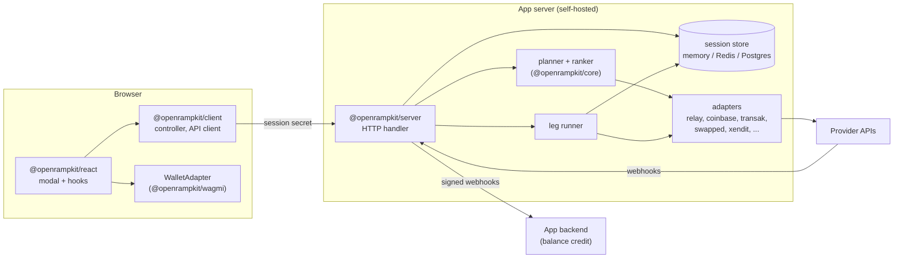
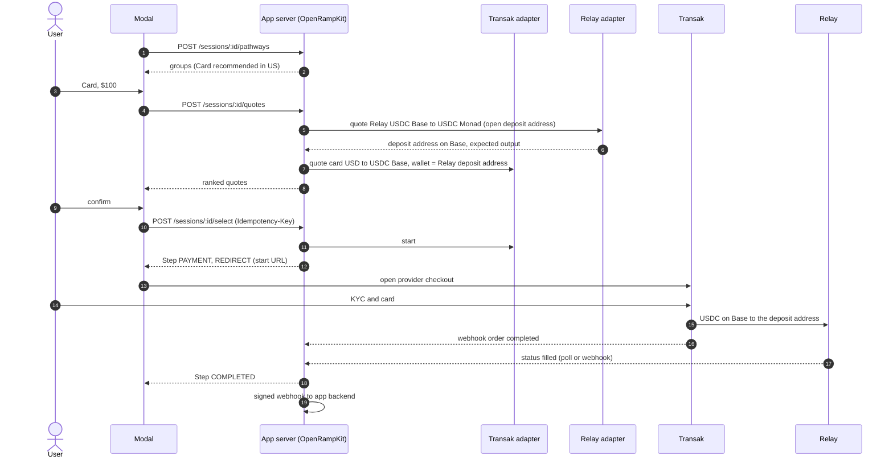

# OpenRampKit: technical spec and implementation plan

Version 0.1 (draft), 2026-09-29. Read [the scope](./scope.md) first for the why. This document is the how.

Conventions:
- "MUST", "SHOULD" and "MAY" have their usual meaning.
- Money values are decimal strings (`"12.50"`), never floats. Token amounts on the wire are base-unit strings (`"12500000"`).
- Chains use CAIP-2 ids (`eip155:8453`, `solana:5eykt4UsFv8P8NJdTREpY1vzqKqZKvdp`, `bip122:000000000019d6689c085ae165831e93`). Tokens use CAIP-19 or `{chain, address}`.
- Countries use ISO 3166-1 alpha-2 (and 3166-2 for regions). Currencies use ISO 4217.
- "To verify" marks a provider fact that must be checked against the provider's current docs or sandbox before we build on it.

---

## 1. Goals and non-goals

Goals:
1. A developer adds Deposit and Withdraw to an app in under 15 minutes, with the app's own provider keys.
2. The same kit serves crypto destinations (an address on a chain) and merchant destinations (the app's fiat account).
3. SEA local rails are first-class.
4. Any third party can add a provider or a leg by publishing an adapter, without a fork.
5. The flow is inspectable: every pathway, leg, quote, fee and status is visible to the app.

Non-goals (v1): custody, KYC storage, our own bridge, our own wallet connection, a hosted backend, React Native, fraud tooling.

## 2. Architecture



Rules:
- The browser never sees a provider secret. It holds only a short-lived session secret.
- The app's server creates each session. The destination, the user id and the amount bounds are fixed at creation and cannot change from the browser.
- The server is stateless apart from the session store, so it runs on serverless and edge platforms.
- `core` has no dependencies and no DOM. `client` has no framework. `react` is a thin layer on `client`.

## 3. Core model (`@openrampkit/core`)

### 3.1 Assets, locations, endpoints

```ts
type Asset =
  | { kind: 'fiat'; currency: string }                         // 'IDR'
  | { kind: 'crypto'; chain: string; token: string }           // CAIP-2 + address ('native' for gas token)

type Location =
  | { kind: 'user_wallet' }                                    // a wallet the user controls
  | { kind: 'user_account' }                                   // user's bank, card or e-wallet
  | { kind: 'merchant_account'; accountRef?: string }          // the app's fiat account at a PSP
  | { kind: 'address'; address: string }                      // a fixed crypto address

type Endpoint = { asset: Asset; location: Location }
```

### 3.2 Destination (set by the app server)

```ts
type Destination =
  | { type: 'crypto'; chain: string; token: string; address: string;
      calls?: ContractCall[] }                                 // optional calls after delivery (EVM, phase 5)
  | { type: 'merchant'; currency: string; accountRef?: string }
```

### 3.3 Money

`core` ships `money.ts`: parse and format decimal strings with a currency's minor units (IDR 0, USD 2, BHD 3), convert base units with token decimals, compare, add and apply bps. It is built on `bigint` only.

### 3.4 Codes

- `countries.ts`: ISO 3166-1 list with default currency.
- `currencies.ts`: ISO 4217 with minor units.
- `methods.ts`: the method vocabulary. It is open (a string union plus `string & {}`) so adapters can add methods. Built-in values:
  `card, apple_pay, google_pay, bank_transfer, sepa, sepa_instant, ach, wire, pix, upi, interac, qris, promptpay, qrph, duitnow, vietqr, paynow, fpx, instapay, gcash, maya, momo, zalopay, gopay, dana, ovo, shopeepay, touchngo, grabpay, boost, cash_app, venmo, revolut_pay, exchange, wallet, transfer`.
- Each method has display metadata (name, icon key, typical ETA) and a default country priority table (for example `ID: qris, gopay, dana, ovo`; `VN: vietqr, momo, bank_transfer`; `TH: promptpay`; `MY: duitnow, touchngo`; `PH: qrph, gcash, maya`; `SG: paynow`).

### 3.5 Region policy

```ts
type RegionPolicy = { allow: string[]; deny: string[] }  // entries: '*', 'VN', 'US-NY'
```
Deny is checked first. A more specific allow can open an exception inside a deny. Both the app config and each leg have a policy. A leg is offered only when both allow the user's region.

### 3.6 Errors

```ts
type OrkError = {
  code: 'REGION_UNSUPPORTED' | 'AMOUNT_TOO_LOW' | 'AMOUNT_TOO_HIGH' | 'QUOTE_EXPIRED'
      | 'PROVIDER_DECLINED' | 'KYC_REJECTED' | 'PAYMENT_FAILED' | 'DELIVERY_FAILED'
      | 'RATE_LIMITED' | 'PROVIDER_UNAVAILABLE' | 'CLIENT_UPGRADE_REQUIRED' | (string & {})
  message: string          // safe to show to the user
  retryable: boolean
  recovery?: 'requote' | 'retry_payment' | 'choose_other' | 'contact_support'
  legId?: string
}
```

## 4. Adapters (`@openrampkit/adapter`)

Adapters work like wagmi connectors. A provider package exports a factory. The app passes configured instances to the server. The server treats every adapter the same way.

### 4.1 Adapter shape

```ts
import { createAdapter } from '@openrampkit/adapter'

export const transak = (opts: { apiKey: string; apiSecret: string; env: 'sandbox' | 'production' }) =>
  createAdapter({
    id: 'transak',
    name: 'Transak',
    apiVersion: 1,                      // adapter API version this adapter targets
    legs: [ /* LegSpec[] (static) */ ],
    async catalog(ctx) { /* optional: live methods, limits, supported assets */ },
    async quote(leg, input, ctx) { /* LegQuote */ },
    async start(leg, quote, ctx) { /* first LegStep */ },
    async transition(leg, ref, name, input, ctx) { /* next LegStep */ },
    async status(leg, ref, ctx) { /* LegStep */ },
    webhook: { verify(req, ctx) {}, parse(req, ctx) { /* LegEvent[] */ } },
    health: async (ctx) => ({ ok: true }),
  })
```

### 4.2 Leg spec (static declaration)

```ts
interface LegSpec {
  id: string                            // unique in the adapter: 'card', 'qris', 'bridge'
  kind: 'fiat_onramp' | 'fiat_payin' | 'wallet_transfer' | 'bridge_swap'
      | 'crypto_withdraw' | 'crypto_offramp' | 'fiat_payout'
  methods?: string[]                    // for fiat legs: ['card','apple_pay'] or ['vietqr','momo']
  from: EndpointMatcher                 // which endpoints this leg can start from
  to: EndpointMatcher                   // which endpoints it can deliver to
  regions: RegionPolicy
  limits?: { min?: string; max?: string; currency: string }   // static hint; quotes are exact
  eta: { min: number; max: number }     // seconds
  surfaces: SurfaceKind[]               // what the client must be able to show
  requires?: Array<'provider_account' | 'provider_kyc' | 'wallet' | 'otp'>
  capabilities?: Array<'settlement' | 'surface_after_processing'>  // results come from status() and webhook, not from a capability
}
```

`EndpointMatcher` matches on asset kind, currency, chain and token lists, and location kind. A leg MAY return a dynamic list from `catalog()` (for example, Swapped's methods per currency, or Relay's supported routes). The planner uses the static spec first and the catalog when present.

### 4.3 Context given to adapters

```ts
interface AdapterContext {
  session: { id: string; userId: string; country?: string; locale: string; livemode: boolean }
  destination: Destination
  urls: { returnUrl: string; webhookUrl: string; startUrl(token: string): string }
  store: ScopedKV                        // per-session scratch data for the adapter
  fetch: typeof fetch                    // instrumented, with timeout and redaction
  log: Logger
  idempotencyKey(scope: string): string
}
```

### 4.4 Rules for adapter authors

- Adapters MUST be pure server code. They MUST NOT read global env vars; all config comes from the factory options.
- Adapters MUST verify webhook signatures and MUST be idempotent on repeated webhooks.
- Adapters MUST return money as decimal strings and MUST fill every fee they know in `LegQuote.fees`.
- Adapters MUST NOT store KYC data. They MAY store provider references (order id, customer id).
- Naming: first-party packages are `@openrampkit/adapter-<id>`. Community packages SHOULD be `openrampkit-adapter-<id>`.
- Versioning: `apiVersion` is checked at startup. The server refuses an adapter whose `apiVersion` it does not support, with a clear error.

### 4.5 Test kit (`@openrampkit/adapter/testing`)

Any adapter can run `runAdapterConformance(adapter, fixtures)` in its own test suite. It checks:
- Leg specs are valid and do not overlap in id.
- `quote()` output matches the schema, money strings are exact, fees add up to the stated total.
- Every `LegStep` the adapter returns is a legal state from the flow table (§6), and terminal states are marked from the table.
- Webhook replay gives the same result (idempotency).
- A fixture run with `fakeFetch` passes from start to a terminal state (`runAdapterConformance`).

### 4.6 Wallet adapter

Separate from provider adapters. It runs in the browser.

```ts
interface WalletAdapter {
  id: string
  getAccounts(): Promise<Array<{ chain: string; address: string }>>
  getBalances(accounts: Array<{ chain: string; address: string }>): Promise<Balance[]>
  sendTransactions(chain: string, txs: TxRequest[]): Promise<{ hash: string }>
  signTypedData?(chain: string, data: unknown): Promise<string>
  switchChain?(chain: string): Promise<void>
}
```
`@openrampkit/wagmi` implements it with the app's existing wagmi config. Later adapters: Solana wallet-standard, Privy, Dynamic.

## 5. Pathway planner

### 5.1 Input and output

```ts
planPathways({
  direction: 'deposit' | 'withdraw',
  destination,                    // deposit: where money ends; withdraw: where it starts
  user: { country, region?, connected?: { chain, address }[], balances?: Balance[] },
  adapters,                       // with their leg specs and catalogs
  policy,                         // app config: enabled adapters, method priority, maxLegs, blocked methods
  amount?,                        // optional; if absent, limits are not applied yet
}): PathwayGroup[]
```

```ts
type Pathway = {
  id: string                      // stable hash of the leg chain, e.g. 'swapped.vietqr>relay.bridge'
  legs: Array<{ adapterId: string; legId: string; from: Endpoint; to: Endpoint }>
  method: string                  // user-facing method of the first leg
  group: 'connected' | 'recommended' | 'more' | 'unavailable'
  reason?: OrkError               // for 'unavailable'
  eta: { min: number; max: number }
  limits?: { min?: string; max?: string; currency: string }
}
```

### 5.2 Algorithm

1. Build the target endpoint from the destination.
2. Build the source endpoints: the user's fiat account in the country's currencies, the connected wallet balances, and "any token on any listed chain" for transfer.
3. Search backwards from the target with breadth-first search, up to `maxLegs` (default 2, max 3). A leg can join the chain when its `to` matches the next leg's `from`.
4. Remove paths where any leg fails the region policy, the capability check (for example, the client cannot show a `PROVIDER_SDK` surface), or the static limits. Keep them in `unavailable` with the reason when the method would otherwise be useful to show (for example, "Not in your region").
5. Collapse paths with the same first method: keep the best few (default 3) per method for quoting.
6. Group:
   - `connected`: the user can pay now with no new account (wallet balance, a linked exchange, a saved method).
   - `recommended`: the top method for the user's country from the priority table, then by expected net amount.
   - `more`: the rest.
   - `unavailable`: with reasons.
7. Return groups. The planner is a pure function in `core`, so it is unit-tested with no network.

### 5.3 Quoting and ranking

- The server quotes the candidate pathways of the chosen method in parallel. Each leg quote has a timeout (default 4 s). A pathway quote is the chain of leg quotes: the output of leg n is the input of leg n+1.
- For two-leg pathways, the server quotes leg 1 first, then quotes leg 2 with leg 1's expected output. If leg 2 is Relay with an open deposit address, the server gets the deposit address in the same call (§9).
- Score (default, configurable): net amount delivered in destination terms, then ETA, then the adapter's recent success rate, then the app's provider preference. The best one is marked "Best price" or "Fastest".
- Quotes carry `expiresAt`. The client re-quotes 10 s before expiry while the quote screen is open.

## 6. Flow state machine

### 6.1 Steps

The server sends one `Step` at a time. The client draws the state and offers the transitions.

```ts
type Step = {
  sessionId: string
  state: StateName
  sub?: string                                  // e.g. KYC 'IN_REVIEW'
  legIndex?: number                             // which leg this step belongs to
  surface?: Surface                             // what to show
  transitions: Transition[]                     // what the user or client can do now
  error?: OrkError                              // errors are fields, never states
  progress?: { legs: Array<{ id: string; status: LegStatus }> }
  expiresAt?: string
}

type StateName =
  | 'SELECT_METHOD' | 'AMOUNT' | 'QUOTE' | 'AUTH' | 'KYC' | 'PAYMENT'
  | 'PROCESSING' | 'COMPLETED' | 'FAILED' | 'EXPIRED' | 'REFUNDED' | 'BLOCKED'

type Surface =
  | { kind: 'REDIRECT'; url: string; popup: boolean }           // popup-safe start URL (§7.4)
  | { kind: 'IFRAME'; url: string; allow?: string; origin: string }
  | { kind: 'PROVIDER_SDK'; provider: string; params: Record<string, unknown> }
  | { kind: 'QR'; payload: string; image?: string; amount: string; currency: string; reference?: string }
  | { kind: 'DEEPLINK'; url: string; appName: string }
  | { kind: 'BANK_FIELDS'; fields: Array<{ label: string; value: string; copy: boolean }> }
  | { kind: 'DEPOSIT_ADDRESS'; chain: string; token: string; address: string; min?: string; memo?: string }
  | { kind: 'WALLET_TX'; chain: string; txs: TxRequest[] }
  | { kind: 'OTP'; channel: 'email' | 'sms'; to: string }
  | { kind: 'FORM'; fields: FieldSpec[] }

type Transition =
  | { name: string; kind: 'SUBMIT'; label: string; inputs?: FieldSpec[] }
  | { name: string; kind: 'AWAIT'; poll: { intervalMs: number; backoff: number; maxIntervalMs: number; giveUpAfterMs: number } }
  | { name: string; kind: 'SURFACE_RESULT'; expects: 'completed' | 'closed' | 'tx_hash' }
```

### 6.2 Transition table

`core/table.ts` holds the table as data: for each state and sub-state, the legal transitions, the states they may lead to, and `terminal: boolean`. Terminal states: `COMPLETED`, `FAILED` (non-retryable), `EXPIRED`, `REFUNDED`, `BLOCKED`. `KYC/ON_HOLD` has no transitions and is not terminal. The server and client both import the table. The test kit and the server's own tests walk it.

### 6.3 Legs inside a session

A session runs its pathway's legs in order. Each leg has a `LegStatus`: `pending`, `awaiting_user`, `processing`, `succeeded`, `failed`, `refunded`, `expired`. The session's `PROCESSING` step shows progress for all legs. A later leg starts automatically when the earlier leg's output arrives. With Relay open deposit addresses, leg 2 needs no action from us: the provider pays into the Relay address, and Relay fills.

### 6.4 Sequence (card to an unlisted chain)



## 7. Server (`@openrampkit/server`)

### 7.1 Setup

```ts
import { createOpenRamp } from '@openrampkit/server'
import { relay } from '@openrampkit/adapter-relay'
import { transak } from '@openrampkit/adapter-transak'
import { swapped } from '@openrampkit/adapter-swapped'
import { xendit } from '@openrampkit/adapter-xendit'
import { redisStore } from '@openrampkit/server/stores/redis'

export const openramp = createOpenRamp({
  secret: process.env.OPENRAMP_SECRET!,            // signs session secrets and start URLs
  baseUrl: 'https://app.example.com/api/openramp',
  store: redisStore(redis),
  adapters: [relay({ refundTo: 'origin' }), transak({...}), swapped({...}), xendit({...})],
  policy: { maxLegs: 2, methodPriority: { VN: ['vietqr', 'momo'] }, regions: { allow: ['*'], deny: ['US-NY'] } },
  appFee: { bps: 0 },                               // optional; passed to Relay appFees with the app's address
  webhooks: { url: 'https://app.example.com/hooks/openramp', secret: process.env.OPENRAMP_WEBHOOK_SECRET! },
  geo: (req) => req.headers.get('cf-ipcountry') ?? undefined,
})

// Next.js: app/api/openramp/[...path]/route.ts
export const { GET, POST } = openramp.nextHandlers()
```

### 7.2 HTTP routes

All routes are relative to `baseUrl`. The app's own code calls session creation from its server. The browser calls the rest with the session secret in the `Authorization: Bearer` header.

| Route | Caller | Purpose |
|---|---|---|
| `openramp.sessions.create({ userId, direction, destination, amount?, allowedMethods?, metadata })` | app server (SDK call, not HTTP) | Create a session. Returns `{ id, clientSecret, expiresAt }` |
| `GET /sessions/:id` | browser | Session and current step |
| `POST /sessions/:id/pathways` | browser | Grouped pathways for this user and country |
| `POST /sessions/:id/quotes` | browser | `{ method or pathwayIds, amount, amountSide: 'source' or 'destination' }` returns ranked quotes |
| `POST /sessions/:id/select` | browser | `{ quoteId }` with `Idempotency-Key`. Starts leg 1 and returns a `Step` |
| `POST /sessions/:id/transitions/:name` | browser | `{ inputs }` with `Idempotency-Key`. Returns the next `Step` |
| `GET /sessions/:id/step` | browser | Poll the current step (used by `AWAIT`) |
| `GET /start/:token` | browser (new tab) | Popup-safe start: verifies the signed token and returns a 302 to the provider |
| `POST /webhooks/:adapterId` | provider | Verified by the adapter. Updates leg status |
| `GET /health` | ops | Adapter health checks |

### 7.3 Sessions and security

- `clientSecret` is `sess_<id>_<random>`. The server stores only its hash. Expiry defaults to 30 minutes, and each successful step extends it.
- The destination, `userId`, `direction`, amount bounds and allowed methods are fixed when the session is created.
- Every POST from the browser MUST carry an `Idempotency-Key`. The server stores the response for 24 hours per session and key.
- Rate limits per session and per IP (pluggable).
- CORS: same origin by default, with an allow list for other origins.
- Provider webhooks go through `adapter.webhook.verify` before any state change.

### 7.4 Popup-safe start URL

When a surface is a redirect to a provider, the server returns `REDIRECT { url: baseUrl + '/start/' + token, popup: true }`. The client opens it inside the click handler, so the browser allows it. The token is signed, holds the session id, leg index and a nonce, and expires in 5 minutes. The route resolves the provider URL at open time and returns a 302. This also keeps signed provider URLs (Swapped, Coinbase session tokens) out of client logs.

### 7.5 Storage

```ts
interface SessionStore {
  get(id: string): Promise<SessionRecord | null>
  put(rec: SessionRecord, opts?: { ifVersion?: number }): Promise<void>   // optimistic lock
  idempotency: { get(key: string): Promise<unknown>; put(key: string, value: unknown, ttlSec: number): Promise<void> }
  kv: ScopedKV                                                            // adapter scratch data
  index: { byProviderRef(adapterId: string, ref: string): Promise<string | null> }  // webhook lookup
}
```
v1 ships `memoryStore` (dev only), `redisStore`, and `postgresStore` (Drizzle, one table plus one index table).

### 7.6 Status updates

- Webhooks first. Each adapter maps provider events to `LegEvent { legRef, status, amounts?, txHash?, error? }`.
- Polling second. For adapters without webhooks (or as a safety net), the server re-checks open legs when the browser polls `GET /step`, and on a cron route `POST /tasks/sweep` that the app schedules (Vercel Cron, Cloudflare Cron, or a worker).
- Every state change writes one event and, when the session reaches a terminal state or a leg succeeds, sends one signed outbound webhook to the app.

### 7.7 Outbound webhooks to the app

- Envelope: `{ id, type, created, livemode, data: { object } }`.
- Signature: HMAC-SHA256 over `id.timestamp.body`, with headers `openramp-id`, `openramp-timestamp`, `openramp-signature`. Timestamps older than 300 s are rejected. `openramp.webhooks.verify(req)` is provided.
- Types: `session.created`, `session.completed`, `session.failed`, `session.expired`, `leg.succeeded`, `leg.failed`, `deposit.received` (merchant destination), `withdrawal.completed`.
- Retries with exponential backoff for 24 hours. The app MUST treat them as at-least-once and credit balances idempotently by `session.id`.

## 8. Client and UI

### 8.1 Client controller (`@openrampkit/client`)

```ts
const ctl = createOpenRampClient({ baseUrl: '/api/openramp', wallet?: WalletAdapter })
const run = ctl.begin({ clientSecret })          // returns a controller for one session
run.subscribe(() => render(run.getSnapshot()))   // { step, pathways, quotes, busy, error }
await run.selectMethod('vietqr'); await run.setAmount('500000'); await run.confirm(quoteId)
run.fire('confirm_paid', inputs)
const result = await run.done                     // resolves on terminal state
```
It follows transitions only: it never guesses the next state. It handles `AWAIT` polling with the given backoff, and `WALLET_TX` surfaces through the `WalletAdapter`.

### 8.2 React (`@openrampkit/react`)

```tsx
<OpenRampProvider baseUrl="/api/openramp" wallet={wagmiAdapter(config)} theme={darkTheme({ accent: '#2744C4' })} locale="vi">
  <DepositButton getClientSecret={() => fetch('/api/deposit-session').then(r => r.json()).then(j => j.clientSecret)}
                 onEvent={(e) => analytics.track(e.type, e.data)}
                 onComplete={(s) => refetchBalance()} />
</OpenRampProvider>
```

- `useOpenRamp()` returns `{ beginDeposit, beginWithdraw, close }`. Each `begin` returns a Promise that resolves with the final session.
- Headless hooks: `useSession`, `usePathways`, `useQuotes`, `useStep`, `useTransition`.
- `DepositButton.Custom` gives a render prop, like `ConnectButton.Custom`.
- Screens: method picker (tabs "Use Crypto" and "Use Cash"), amount (local currency, preset chips), quote list, surfaces (QR, bank fields, deposit address, redirect, iframe, OTP, form), processing with leg progress, result.
- The modal renders in a portal. Styles are scoped with an `ork-` class prefix and CSS variables. The later web component uses Shadow DOM.
- Accessibility: focus trap, `aria-modal`, Escape to close, full keyboard use, reduced motion.
- i18n: `en` in phase 1; `vi`, `id`, `th`, `ms`, `fil` by the public alpha. All copy lives in message catalogs.

### 8.3 Theming

- Tokens as CSS variables: `--ork-color-*` (about 16 per mode), `--ork-radius-*`, `--ork-font-*`, `--ork-shadow-*`.
- `lightTheme()`, `darkTheme()`, `autoTheme()` helpers with `accent`, `radius` and `font` options, like RainbowKit.
- An `appearance` object for full control, like D0: colors per mode, radius per component, borders, fonts, and the merchant name and logo.

### 8.4 Events (browser)

Same envelope as the webhooks. Types: `modal.opened`, `method.selected`, `amount.entered`, `quotes.shown`, `quote.selected`, `surface.opened`, `step.changed`, `session.completed`, `session.failed`, `modal.closed` (with the last step). These map to funnel analytics.

## 9. Relay integration (`@openrampkit/adapter-relay`)

Relay gives two legs:

- `bridge_swap` (wallet): the user's wallet signs the steps from `POST /quote/v2`. The client runs them through the `WalletAdapter` (`WALLET_TX` surface). Status comes from `GET /intents/status/v3`.
- `bridge_swap` (deposit address): `POST /quote/v2` with `useDepositAddress: true` returns a `depositAddress` and `requestId`.
  - Use **open** deposit addresses for "Transfer crypto" and for the onramp hop. They take variable amounts and are reusable for the same route (origin chain and token, destination chain and token). The adapter caches one per user and route in `ctx.store`.
  - Use **strict** deposit addresses when an exact amount is required (payments). Strict needs `refundTo`.
  - Always set `refundTo`. Default: the origin native-currency address, which turns on automatic refund to the sender. The app MAY set `recoveryAddress`.
  - Show warnings in the UI: send only the stated token on the stated chain. Wrong-token and wrong-chain recovery is limited (see Relay docs).
- App fees: when `appFee.bps > 0`, pass `appFees: [{ recipient: appFee.address, fee }]`. Fees accrue as a USDC balance at Relay that the app claims. OpenRampKit adds no fee of its own.
- Use the app's Relay API key when given (higher rate limits, and revenue share above Relay's volume tier).

## 10. First-party adapters

| Adapter | Legs | Surface | Phase | Notes |
|---|---|---|---|---|
| `relay` | `bridge_swap` (wallet and deposit address) | WALLET_TX, DEPOSIT_ADDRESS | 2 | See §9 |
| `transfer` | virtual adapter: shows a Relay open deposit address, or the app's own address when the destination is the same chain and token | DEPOSIT_ADDRESS | 2 | With an optional watcher hook for app addresses |
| `coinbase` | `fiat_onramp` (card, Apple Pay, Coinbase balance) | REDIRECT | 3 | Needs a CDP project; session tokens created server-side (to verify). Guest checkout limits by region (to verify) |
| `transak` | `fiat_onramp` (card, bank, local methods by country) | REDIRECT or IFRAME | 3 | Widget URL created server-side with a signed request (to verify). Webhooks signed (to verify) |
| `swapped` | `fiat_onramp` (card, Apple Pay, Google Pay, SEPA and SEA local methods), later `crypto_offramp` | IFRAME | 3 | Signed widget URL with `apiKey`, `signature`, `currencyCode`, `walletAddress`, `method`. Methods from `GET /api/v1/merchant/get_payment_methods`. Event `SWAPPED_ORDER_DATA`. User needs a Swapped account (OTP) |
| `xendit` | `fiat_payin` (QRIS, QRPh, PromptPay, DuitNow, VietQR, e-wallets), later `fiat_payout` | QR, DEEPLINK, BANK_FIELDS | 4 | Merchant destination only. Method coverage per country to verify |
| `moonpay` | `fiat_onramp`, `crypto_offramp` | REDIRECT or IFRAME | 5 | Signed URLs |
| `stripe` | `fiat_onramp` (Stripe Crypto Onramp) | PROVIDER_SDK | 5 | Needs Stripe approval; US and EU |
| `meld` | `fiat_onramp` (aggregated quotes from many providers) | REDIRECT | 5 | One key for many providers |
| `onramper` | `fiat_onramp` (aggregated) | REDIRECT | 5 | Checkout intent v2 signed with Ed25519 |
| `lifi` | `bridge_swap` | WALLET_TX | 5 | Second routing option |

## 11. Security and compliance

- No custody: the kit never holds private keys or pooled funds. Destinations are the app's addresses and accounts, or Relay deposit addresses bound to the app's recipient.
- No KYC storage: providers run KYC in their own surfaces. The kit stores provider references only.
- Secrets live only on the server. The browser gets a short-lived session secret.
- Iframes: strict `origin` checks on every `postMessage`; `sandbox` and `allow` attributes per provider; CSP guidance in the docs.
- Logs: a redactor removes emails, phone numbers, bank fields and tokens by default.
- Sanctions and address screening: a `screen(address)` hook that the app MAY connect (for example to Chainalysis). Relay also screens addresses on its side.
- Legal: before the public alpha, get a legal review of the "software only" position for the US, the EU (MiCA), Singapore and Vietnam, and document it for integrators.

## 12. Testing

| Layer | Tool | What |
|---|---|---|
| core | Vitest, property tests (fast-check) | money math, region policy, planner, ranking, table walk |
| adapters | Vitest + MSW recorded fixtures + test kit | contract and replay tests, no network |
| server | Vitest with a real Redis and Postgres in Docker | routes, idempotency, optimistic locking, webhook replay |
| UI | Storybook + Chromatic (or Playwright screenshots) | every screen in light, dark and RTL-free locales, at phone and desktop width |
| end to end | Playwright against provider sandboxes | nightly: one full deposit per first-party adapter |

## 13. Repository and tooling

```
openrampkit/
  packages/
    core/  adapter/  adapter-testkit/  server/  client/  react/  wagmi/
    adapters/relay/  adapters/transfer/  adapters/coinbase/  adapters/transak/
    adapters/swapped/  adapters/xendit/
  apps/
    playground/      # appearance playground + live demo, like demo.d0fi.com
    docs/            # docs site
  examples/
    next-crypto/     # deposit USDC to Base, with RainbowKit
    next-merchant/   # QRIS top-up into a merchant account, no wallet
    hono-server/     # server on Cloudflare Workers
  docs/            # VitePress docs site (this site); design/ holds scope, spec, research
```

- pnpm workspaces, Turborepo, TypeScript strict, tsup (ESM + CJS), Biome for lint and format, Changesets for releases, GitHub Actions CI.
- Bundle budgets checked in CI: `core` under 15 KB gzip, `client` under 10 KB, `react` under 60 KB (without wagmi).
- Supported runtimes: Node 20+, Bun, Deno, Cloudflare Workers, Vercel Edge. React 18 and 19.

## 14. Implementation plan (phases)

Estimates assume 2 engineers and 1 designer part time. Each phase ends with a demo and a written exit check.

### Phase 0: foundation (week 1 to 2)

Deliverables:
- Monorepo with tooling, CI, Changesets, license, contributing guide, code of conduct.
- GitHub org `openrampkit`, npm scope `@openrampkit`, domain.
- Provider sandbox applications sent: Relay API key, Coinbase CDP, Transak, Swapped, Xendit. Stripe and MoonPay applications started.
- Design: modal screens in Figma for crypto and cash, light and dark, phone and desktop.
- Legal: first call on the "software only" position.

Exit: CI green on an empty package set; designs reviewed; at least 3 sandbox accounts approved.

### Phase 1: core, adapter API and mock UI (week 3 to 6)

Deliverables:
- `core`: types, money, codes (with SEA methods and country priority), region policy, errors, event envelope, transition table, planner, ranker. 95% line coverage.
- `adapter` and `adapter-testkit`: `createAdapter`, leg specs, conformance suite.
- `adapter-mock`: a fake provider with every surface kind, used by tests and the playground.
- `server`: session create, pathways, quotes, select, transitions, step poll, start URL, memory store, idempotency, outbound webhooks.
- `client` controller and `react` modal with all screens against the mock adapter.
- `apps/playground` v0: live theme editor and mock flows.

Exit: a full mock deposit runs end to end in the playground for every surface kind; the table walk and conformance suite pass.

### Phase 2: crypto pathways (week 7 to 9)

Deliverables:
- `adapter-relay` (wallet and deposit address legs), `adapter-transfer`.
- `wagmi` WalletAdapter; "Pay from wallet" with balances.
- Redis and Postgres stores; cron sweep route.
- `examples/next-crypto` with RainbowKit, depositing USDC to Base and to Monad.

Exit: real deposits on mainnet with small amounts: wallet (same chain), wallet (cross-chain), transfer to a Relay open deposit address (reused twice), refund on a wrong amount.

### Phase 3: fiat onramps and SEA via Swapped (week 10 to 14)

Deliverables:
- `adapter-coinbase`, `adapter-transak`, `adapter-swapped` (live method catalog by currency).
- The two-leg hop: onramp to a Relay open deposit address on a listed chain, then Relay to the destination.
- "Use Cash" tab with country method priority; quote list with "Best price".
- i18n: `vi`, `id`, `th`, `ms`, `fil`.
- Nightly sandbox end-to-end tests.

Exit: sandbox card deposit (Coinbase or Transak) to Base; sandbox Swapped VietQR or GCash order to a Relay deposit address; hop to an unlisted chain proven on mainnet with a small amount.

### Phase 4: merchant destination and public alpha (week 15 to 18)

Deliverables:
- `adapter-xendit` `fiat_payin` for QRIS, QRPh, PromptPay, DuitNow and VietQR (as coverage allows), with webhooks.
- `examples/next-merchant`: wallet top-up in IDR with no crypto and no wallet.
- Docs site: quickstart, concepts (pathways, legs, adapters), adapter authoring guide, security guide, provider setup guides.
- Legal review done; integrator guidance published.
- Onboard 3 design partners.
- Launch: npm `0.x`, launch post, playground public.

Exit: 3 design partners live in production (1 crypto app, 1 SEA merchant, 1 new chain); time to first sandbox deposit under 15 minutes in a user test.

### Phase 5: withdraw, offramp and reach (week 19 to 26)

Deliverables:
- Withdraw: crypto to any address (wallet signs, then Relay); Xendit `fiat_payout` to bank and e-wallet; Swapped and MoonPay `crypto_offramp`.
- More adapters: `moonpay`, `stripe`, `meld`, `onramper`, `lifi`.
- Post-delivery contract calls on EVM destinations.
- `@openrampkit/web` (web component in Shadow DOM) plus thin Vue, Svelte and Solid wrappers.
- React Native package (`client` + native screens + in-app browser for surfaces).
- Wallet adapters for Solana wallet-standard and Privy.

Exit: one real payout in PH or ID; one offramp to a bank; web component used in a non-React app.

### Phase 6 (optional): OpenRamp Cloud

Only if the business-model decision is "open core". A hosted version of `server` with managed webhooks, a dashboard (sessions, funnel by country and method, adapter health), quote caching and provider onboarding help. The open-source packages stay complete without it.

## 15. Open questions

1. Business model (pure open source or open core). Affects only phase 6.
2. Which provider accounts we can get first. Affects the order inside phases 3 and 4.
3. Formo event mapping for the funnel events.
4. Whether a second SEA onramp (Transak local methods, Alchemy Pay or TransFi) is needed next to Swapped, to avoid the Swapped account step.
5. Whether `transfer` should also support the app's own watcher (Alchemy or Helius webhooks) for apps that do not want Relay in the path.
