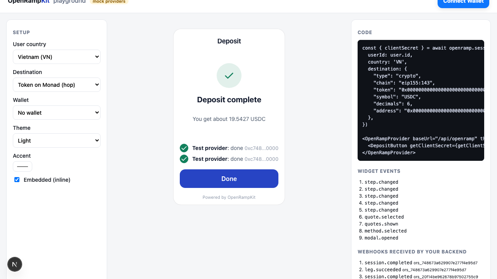
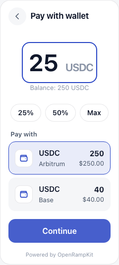
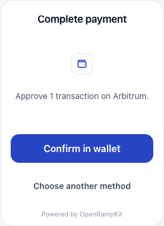
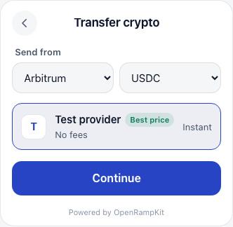
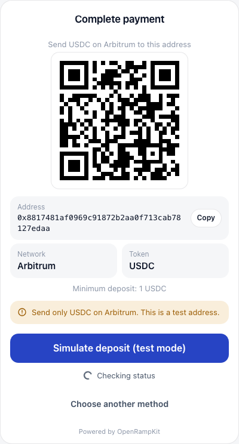
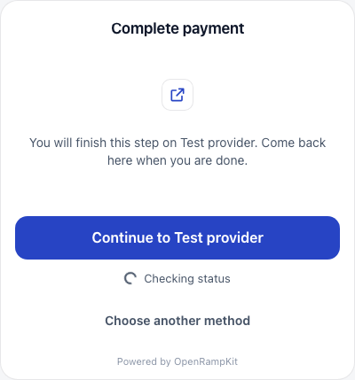
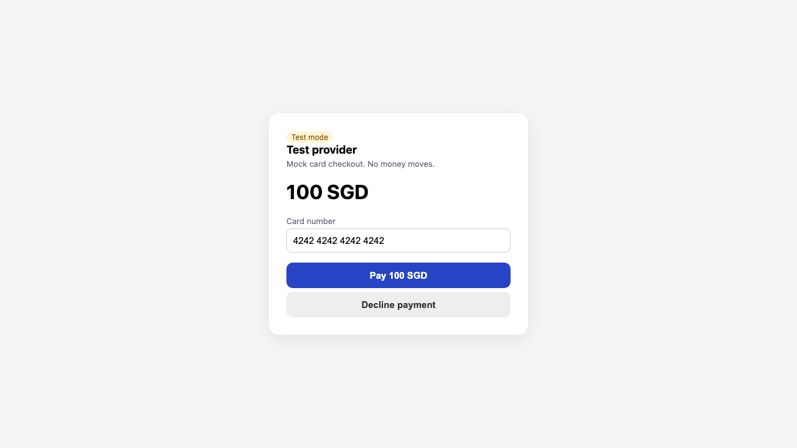
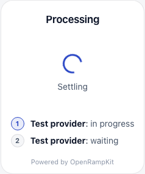
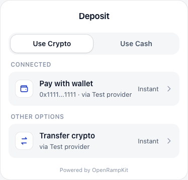

# Examples

## Next.js playground

[`examples/next-demo`](https://github.com/yosriady/openrampkit/tree/main/examples/next-demo) is a Next.js App Router app with a playground. You pick the flow (deposit or withdraw), the user's country, the destination, who holds the funds, the wallet, the theme and the accent color, and the widget restarts with a new session. The page also shows the widget events and the webhooks your backend received.



```bash
pnpm install
cp examples/next-demo/.env.example examples/next-demo/.env.local
pnpm dev:example   # http://localhost:3000
```

| Variable | Default | Description |
|---|---|---|
| `OPENRAMP_SECRET` | a dev value | 32+ characters |
| `PUBLIC_URL` | `http://localhost:3000` | Used for `baseUrl` and the webhook URL |
| `OPENRAMP_MOCK` | `1` | `1`: mock providers only, works offline. `0`: real Relay for wallet and transfer, mock fiat. |
| `NEXT_PUBLIC_WALLETCONNECT_PROJECT_ID` | empty | Only browser wallets work without it |
| `XENDIT_SECRET_KEY`, `XENDIT_WEBHOOK_TOKEN` | empty | Adds real Xendit merchant pay-in when both are set |

What to look at:

| File | Shows |
|---|---|
| `lib/openramp.ts` | `createOpenRamp` with mock (including `offramp: true`), Relay and Xendit adapters, webhooks, and the withdraw hooks `screenAddress` and `treasury` |
| `app/api/openramp/[...path]/route.ts` | Mounting the handler with `nextHandlers()` |
| `app/api/deposit-session/route.ts` | Creating a session in your backend |
| `app/api/withdraw-session/route.ts` | Creating a withdraw session with `source`, `custody` and `allowedTargets` |
| `app/api/cron/route.ts`, `vercel.json` | The background sweep as a Vercel Cron Job, checked with `CRON_SECRET` |
| `app/api/hooks/route.ts` | Verifying webhooks with `openramp.webhooks.verify` |
| `components/Playground.tsx` | `OpenRampProvider`, `DepositButton`, `WithdrawButton`, `OpenRampEmbedded`, themes, `createMockWallet`, `wagmiWallet` |
| `e2e/deposit.spec.ts`, `e2e/withdraw.spec.ts` | Playwright flows on desktop, Android and iPhone |
| `e2e/screens.spec.ts` | Screenshot capture |

Flows to try:

| Setup | Flow |
|---|---|
| Vietnam, Token on Monad | VietQR, then a mock bridge hop: a two-leg pathway |
| Singapore, USDC on Base | Card by a popup-safe redirect to a hosted checkout |
| United States, mock wallet | Pay with wallet (`WALLET_TX`) |
| Germany, no wallet | Transfer crypto to a deposit address |
| Indonesia, Merchant fiat account | QRIS pay-in, no crypto |
| Philippines, embedded off | Modal mode; a bottom sheet on phones |
| Withdraw, United States, mock wallet | To wallet: USDC on Base to an Arbitrum address |
| Withdraw, Philippines, mock wallet | To cash: a GCash payout through the mock offramp |
| Withdraw, app holds the funds | The demo treasury sends instead of the wallet |

| Pay from wallet | Confirm in wallet | Transfer: pick a source | Deposit address |
|---|---|---|---|
|  |  |  |  |

| Card redirect | Mock hosted checkout | Processing | Crypto methods |
|---|---|---|---|
|  |  |  |  |

## Cloudflare Worker

[`examples/cloudflare-worker`](https://github.com/yosriady/openrampkit/tree/main/examples/cloudflare-worker) runs the server as a standalone Worker with a KV session store. Your app backend creates sessions over HTTP with a shared API key, through the `authorize` hook. See [Deploy on Cloudflare Workers](../deploy/cloudflare-workers.md).

```bash
cd examples/cloudflare-worker
cp .dev.vars.example .dev.vars
pnpm dev   # wrangler dev on http://localhost:8787

curl -X POST http://localhost:8787/sessions -H 'x-app-key: dev-app-key' -H 'content-type: application/json' \
  -d '{"userId":"u1","country":"VN","destination":{"type":"crypto","chain":"eip155:8453","token":"0x833589fcd6edb6e08f4c7c32d4f71b54bda02913","address":"0x000000000000000000000000000000000000beef"}}'
```

## Web component demo

`packages/web` has a Vite demo of the bare element (`pnpm --filter @openrampkit/web demo`).
