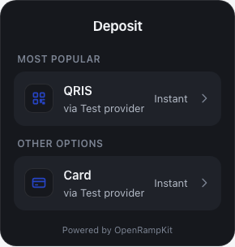
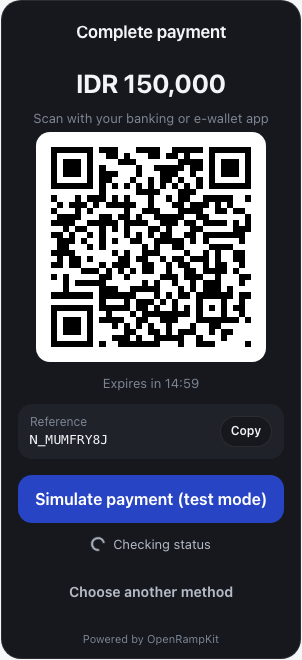

# Merchant fiat destination

OpenRampKit is not only for crypto apps. With a **merchant** destination, the user pays in local currency and the money lands in your own account at a payment provider. There is no crypto in the flow.

This guide uses the [Xendit adapter](../adapters/xendit.md): QRIS, QR Ph, PromptPay and PayNow QR codes, and e-wallets such as GCash, DANA, OVO, ShopeePay, MoMo and ZaloPay.

| Methods (Indonesia, dark theme) | QRIS payment |
|---|---|
|  |  |

## 1. Configure Xendit

```ts
import { createOpenRamp } from '@openrampkit/server'
import { xendit } from '@openrampkit/adapter-xendit'

export const openramp = createOpenRamp({
  secret: process.env.OPENRAMP_SECRET!,
  baseUrl: 'https://app.example.com/api/openramp',
  adapters: [
    xendit({
      secretKey: process.env.XENDIT_SECRET_KEY!, // xnd_development_... or xnd_production_...
      webhookToken: process.env.XENDIT_WEBHOOK_TOKEN!, // Dashboard > Settings > Webhooks
    }),
  ],
  webhooks: { url: 'https://app.example.com/api/hooks', secret: process.env.OPENRAMP_WEBHOOK_SECRET! },
})
```

In the Xendit dashboard, set the payment webhook URL to:

```
https://app.example.com/api/openramp/webhooks/xendit
```

The adapter checks the `x-callback-token` header against `webhookToken`.

## 2. Create a merchant session

```ts
const { clientSecret } = await openramp.sessions.create({
  userId: user.id,
  country: 'ID', // the user's country
  destination: { type: 'merchant', currency: 'IDR' },
  metadata: { orderId: order.id },
})
```

The destination currency is the payment currency. Each Xendit leg accepts one country and one currency, so the session needs both:

| Country | Currency | Methods (Xendit) |
|---|---|---|
| `ID` | `IDR` | `qris`, `dana`, `ovo`, `shopeepay` |
| `PH` | `PHP` | `qrph`, `gcash`, `maya`, `grabpay` |
| `TH` | `THB` | `promptpay`, `truemoney` |
| `MY` | `MYR` | `touchngo`, `grabpay` |
| `VN` | `VND` | `momo`, `zalopay` |
| `SG` | `SGD` | `paynow` |

A user in another country sees the methods as "Not available" (`REGION_UNSUPPORTED`). Use `accountRef` on the destination if you route to more than one merchant account: `{ type: 'merchant', currency: 'IDR', accountRef: 'store-42' }`. The planner copies it to the endpoint; adapters may read it from `ctx.destination`.

## 3. Open the modal

Nothing changes in the browser. Use `DepositButton`, `OpenRampEmbedded` or `openDeposit()` as usual. For merchant sessions:

- The "Use Crypto" tab is hidden. The modal opens on "Use Cash".
- The method order comes from the country's default priority, for example QRIS first in Indonesia.
- The title says "Deposit" by default. For checkout-like flows, set `appearance.title`, `appearance.merchantName` and `appearance.logoUrl` (see [Theming](./theming.md)).

## 4. What the user sees

1. The user picks a method and enters an amount. The adapter checks the channel's minimum and maximum.
2. The quote shows the amount, the fee (if you configured `fees`) and the net amount.
3. On confirm, the adapter creates a Xendit payment request. QR channels show a `QR` surface with a 15-minute countdown. E-wallets show a `REDIRECT` (web checkout) or a `DEEPLINK` (open the app).
4. Xendit sends a webhook when the payment succeeds or fails. The server also polls Xendit while the modal is open.
5. The modal shows "Deposit complete". Your backend receives `session.completed`.

## 5. Credit the order

Handle `session.completed` in your webhook route. The event carries your `metadata`, so you can find the order:

```ts
if (event.type === 'session.completed') {
  const { session, userId, metadata } = event.data.object
  await markOrderPaid(metadata.orderId, { sessionId: session.id, userId })
}
```

`session.result` has the amounts. `result.input` is the amount the user paid. The Xendit webhook does not report an output amount, so `result.output` is the quoted net amount (after the fee model of the adapter) and `result.outputConfirmed` is `false`. Compare `result.input` with the expected amount on your order. Your net settlement is in the Xendit dashboard. See [Webhooks to your backend](./webhooks.md).

## Fees in quotes

Xendit does not return fees in the payment request. To show your real cost in the quote, pass a fee model per method:

```ts
xendit({
  secretKey, webhookToken,
  fees: { qris: { bps: 70 }, gcash: { bps: 230 }, ovo: { bps: 150, fixed: '1000' } },
})
```

`bps` is basis points of the amount. `fixed` is a decimal string in the payment currency. The quote's output is the amount minus these fees.

## Test without Xendit

The [mock adapter](../adapters/mock.md) has a `payin` leg for merchant destinations. It accepts any currency and shows a QR code with a "Simulate payment (test mode)" button:

```ts
adapters: [mockAdapter()]
// session: { destination: { type: 'merchant', currency: 'IDR' }, country: 'ID' }
```

## Limits and open items

- Channel limits in the adapter come from Xendit's channel pages.
- VietQR and DuitNow QR are not in the channel list yet. The PayNow QR channel code is marked **TO VERIFY** in the source.
- The adapter uses one idempotency key per quote (`xendit:{legId}:{nonce}`). A retried start for the same quote reuses the first payment request. A new quote (for example after "Try again") creates a new payment request.
