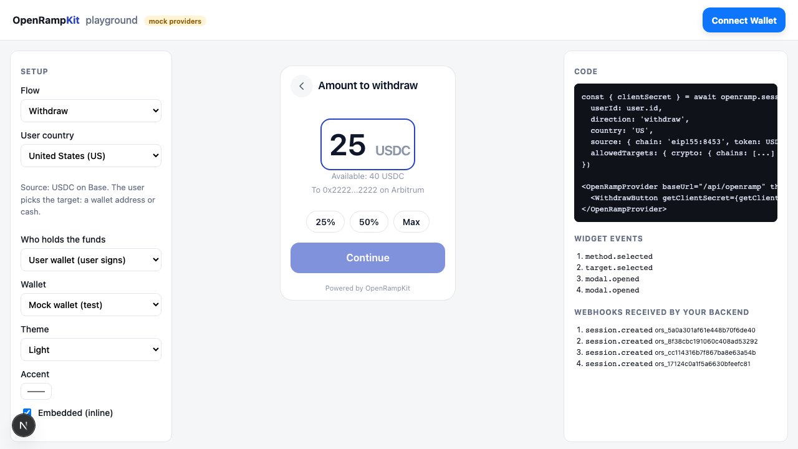
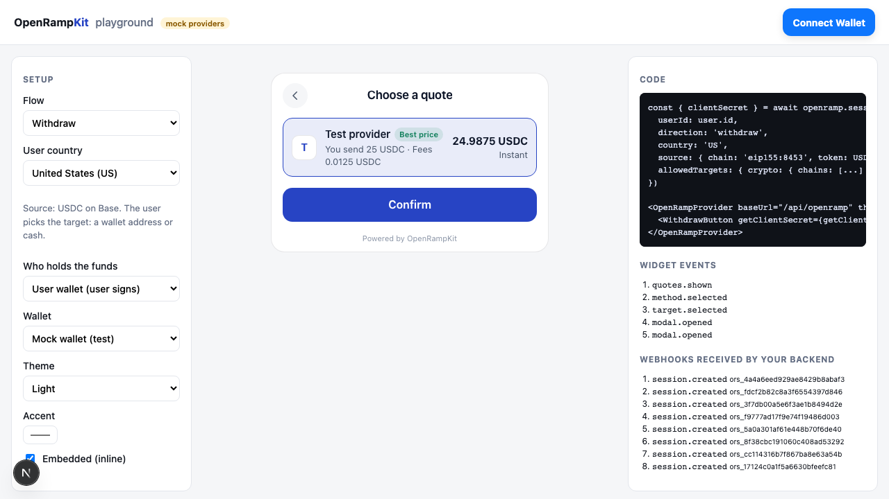
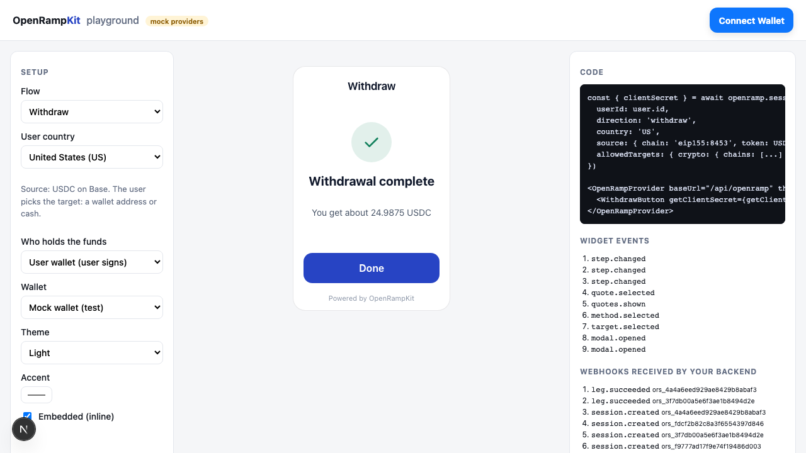
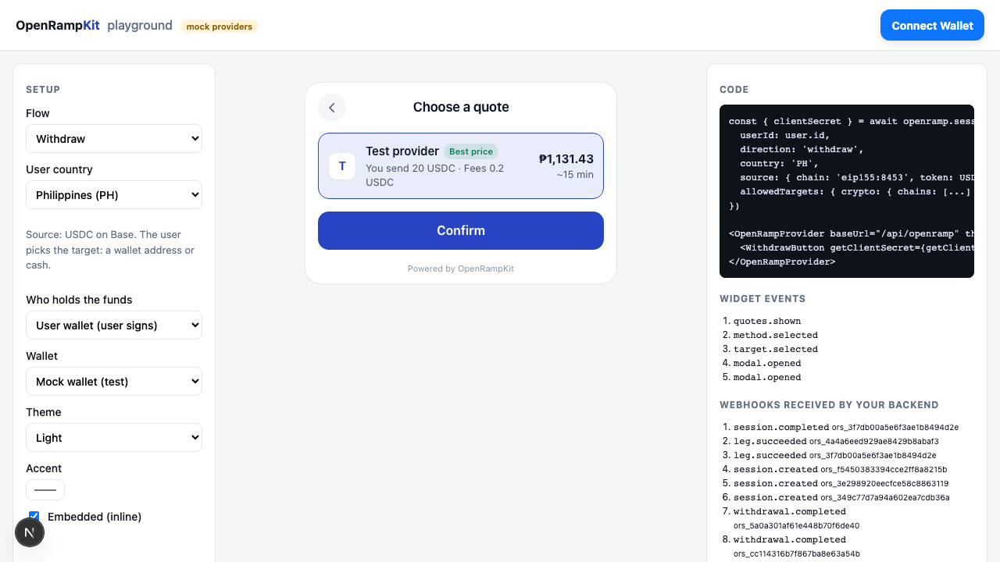
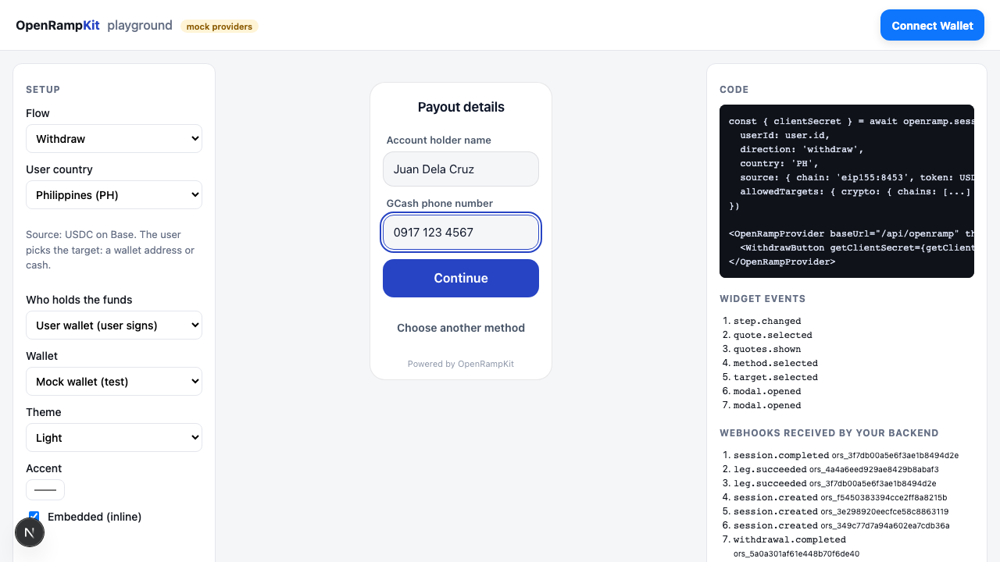
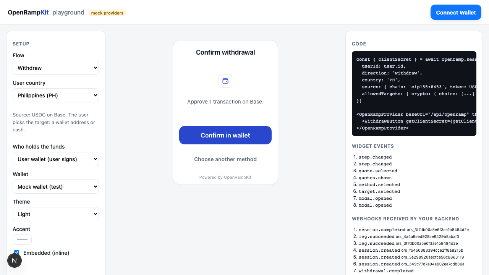

# Withdrawals

A withdraw session moves funds out of your app. Your backend decides **what** leaves (the source asset) and **who holds it** (the user's wallet or your app). The user picks **where it goes**: a wallet address ("To wallet") or their own bank or e-wallet account ("To cash"). Your backend can also set the target and lock it (see [Locked targets](#locked-targets)).

The same modal, server and adapters run deposits and withdrawals. The session's `direction` picks the flow.

## Create a withdraw session

```ts
// app/api/withdraw-session/route.ts
import { openramp } from '@/lib/openramp'

export async function POST() {
  const user = await getUser() // your auth
  const session = await openramp.sessions.create({
    userId: user.id,
    direction: 'withdraw',
    source: {
      chain: 'eip155:8453', // Base
      token: '0x833589fcd6edb6e08f4c7c32d4f71b54bda02913', // USDC on Base
      symbol: 'USDC',
      decimals: 6,
      custody: 'user_wallet', // or 'app'
    },
    // Optional: limit where the user can send it
    allowedTargets: {
      crypto: { chains: ['eip155:8453', 'eip155:42161', 'eip155:10'] },
      fiat: {}, // any currency
    },
    amountBounds: { min: '5', max: '1000', currency: 'USDC' },
    country: 'PH',
  })
  return Response.json(session) // { id, clientSecret, expiresAt }
}
```

A withdraw session takes `source`, not `destination`. The server returns `400` when a withdraw session has a `destination`, or when `source` is missing or not valid:

| Field | Rule |
|---|---|
| `source.chain` | A CAIP-2 chain id, for example `eip155:8453` |
| `source.token` | A token address for that chain, or `native` |
| `source.custody` | `'user_wallet'` or `'app'` (see [Custody](#custody)) |
| `source.symbol`, `source.decimals` | Optional. The server fills them for USDC on known chains and for the native token. |

Set `amountBounds.currency` to the source token symbol (for example `USDC`). The amount the user enters is in the source token, and the server enforces the bounds on it. See [`CreateSessionInput`](../api/server.md#createsessioninput).

## Open the modal

::: code-group

```tsx [React]
import { OpenRampProvider, WithdrawButton } from '@openrampkit/react'

const getClientSecret = () =>
  fetch('/api/withdraw-session', { method: 'POST' }).then((r) => r.json()).then((j) => j.clientSecret)

<OpenRampProvider baseUrl="/api/openramp" wallet={wallet}>
  <WithdrawButton getClientSecret={getClientSecret} onComplete={(s) => refreshBalance()} />
</OpenRampProvider>
```

```ts [Web component]
import { openWithdraw } from '@openrampkit/web'

const handle = openWithdraw({ baseUrl: '/api/openramp', clientSecret: getClientSecret, wallet })
const session = await handle.done // resolves when the withdrawal completes
```

:::

`WithdrawButton`, `WithdrawButton.Custom`, `useOpenRamp().beginWithdraw()`, `openWithdraw()` and `createWithdrawController()` refuse a deposit session. `OpenRampEmbedded` follows the session's direction. See [@openrampkit/react](../api/react.md#withdrawbutton) and [@openrampkit/web](../api/web.md#openwithdraw-options).

## To wallet

The user picks a network, a token and an address. The token list has USDC (when the chain has a known USDC address) and the native token. On the source chain, it also has the source token. The address is prefilled with the connected wallet.

| Target | Amount | Quote |
|---|---|---|
|  |  |  |

1. The modal checks the address format. Then it sends the target to the server with `POST /sessions/:id/target`.
2. The server checks the format again, then [`allowedTargets`](#allowed-targets), then your [`screenAddress`](#screen-addresses) hook. It stores the target as the session destination and returns the plan.
3. When only one method is available, the modal goes straight to the amount screen. The amount is in the source token. The modal shows the wallet balance of the source token when the wallet reports it.
4. The user confirms a quote. The leg asks for a wallet transaction (`WALLET_TX`). With `custody: 'user_wallet'`, the user approves it in the wallet. With `custody: 'app'`, the server sends it through your [treasury hook](#custody-app).
5. The leg completes. The server sends `session.succeeded` and `withdrawal.succeeded`.

| Confirm in wallet | Done |
|---|---|
|  |  |

The [Relay adapter](../adapters/relay.md) runs "To wallet" in production. Its `wallet` leg delivers to any address, across chains and tokens. A move on the same chain and token is a plain transfer that the adapter checks on chain.

## To cash

The "To cash" tab pays out in the user's local currency (from the session `country`). When `allowedTargets.fiat.currencies` does not have that currency, the tab uses the first allowed currency. The modal sends `{ type: 'fiat', currency }` to `POST /sessions/:id/target` and shows the payout methods.

| Payout methods | Quote |
|---|---|
|  |  |

After the user confirms a quote, the offramp provider asks for the payout account (a `FORM`, or its own page in an `IFRAME`). Then it asks for the crypto: a `WALLET_TX` to the provider's deposit address. When the provider pays out, the leg completes.

| Payout details | Send USDC | Done |
|---|---|---|
|  |  |  |

Adapters with offramp legs:

- [Swapped](../adapters/swapped.md#sell-legs-withdraw-to-cash): bank transfer (EUR, DKK, GBP), Skrill, PIX and Interac, with a live payout catalog.
- [Mock](../adapters/mock.md#offramp-leg) with `offramp: true`: bank transfer, GCash, MoMo and PromptPay. It moves no money.

## Custody

`source.custody` tells the server who signs the transaction that sends the funds.

### custody: 'user_wallet'

The funds are in the user's own wallet. The modal shows the `WALLET_TX` step and the user signs it. The user must connect a wallet: without one, every method is in "Not available" with "Connect your wallet to withdraw." The server passes the connected address to providers as the sender.

### custody: 'app'

Your app holds the funds (for example in a hot wallet or a custodial account). The user never signs. When the leg shows a `WALLET_TX` that waits for the user, the server calls your `treasury.send()` hook instead:

```ts
createOpenRamp({
  // ...
  treasury: {
    address: '0xYourHotWallet', // optional: the sender, given to providers for exact quotes (Relay)
    async send({ sessionId, userId, chain, txs, idempotencyKey }) {
      // Check and debit the user's balance first. Refuse by throwing.
      const hash = await hotWallet.sendAll(chain, txs, { idempotencyKey })
      return { hash } // the hash of the last transaction
    },
  },
})
```

| Input | Description |
|---|---|
| `sessionId`, `userId` | The session and your user id |
| `chain` | CAIP-2 chain id of the transactions |
| `txs` | `TxRequest[]`: `{ to, data?, value?, chainId, gas? }`. Send them in order. |
| `idempotencyKey` | Stable for one leg step. Send at most once per key. |

What the server does:

- It marks the step as sent and saves the session (with the version check) before it calls the hook. When two requests start the same step at the same time, one save fails with `409 CONFLICT`, so only one request calls the hook. It calls the hook at most once per step, and the key lets you drop a retry on your side.
- The saved session shows the leg as `processing` before the hook runs. When the server stops, or a provider call fails after the hook sent the funds, the session stays `PROCESSING`: it does not show the `WALLET_TX`, and it refuses `restart` and a new `select`. Thus a second payment cannot make the treasury send again. The sweep polls the provider. When the provider never sees the transfer, the session shows as stuck in the admin tools, and an operator closes it (`admin.resolve`).
- It reports the hash to the adapter (the leg's `tx_hash` transition), or it waits for the provider to see the transfer.
- When the hook throws, the leg fails with `PAYMENT_FAILED` ("The withdrawal could not be sent. Contact support.").
- Without a `treasury` hook, every method of an `app` session is in "Not available" with "Withdrawals are not set up for this app yet."

::: danger The server does not know the user's balance
The server does not check that the user owns the funds that the treasury sends. `amountBounds` limits each withdrawal, but it does not know the balance. In `send()`, check the user's balance for this session, debit it (once per `idempotencyKey`), and throw to refuse. Also check the amount and the recipient of `txs`. An offramp such as Swapped sets the deposit address and the amount in its own webhook, so the transaction can differ from the quote.
:::

Set `treasury.address` when you use Relay. Relay builds its transactions for a sender address. Without it, quotes use a placeholder sender.

## Allowed targets

`allowedTargets` limits what the user can pick. Without it, the user can pick any target.

```ts
type AllowedTargets = {
  crypto?: { chains?: string[] }       // absent: no "To wallet". chains absent: any chain
  fiat?: { currencies?: string[] }     // absent: no "To cash". currencies absent: any currency
}
```

- The modal shows only the allowed tabs. With `crypto.chains`, the network list shows only those chains. Without it, the list has every chain with a known USDC address, plus the source chain.
- The server checks every target. A target that is not allowed gets `403 TARGET_NOT_ALLOWED`.
- When the app allows neither type, the modal shows an error.

## Screen addresses

Add `screenAddress` to check each "To wallet" address before the user can use it. For example, call a sanctions API.

```ts
createOpenRamp({
  // ...
  screenAddress: async (address, chain) => {
    const r = await sanctions.check(address)
    return r.clean // true to allow
  },
})
```

It fails closed:

| Hook result | Response |
|---|---|
| `true` | The target is accepted |
| `false` (or anything that is not `true`) | `403 ADDRESS_REJECTED`: "This address cannot receive withdrawals. Use another address." |
| It throws | `503 PROVIDER_UNAVAILABLE`: "We could not check this address. Try again." |

The server calls it only for crypto targets. Fiat payout accounts are checked by the offramp provider.

## The /target route

`POST {baseUrl}/sessions/:id/target` sets the target of a withdraw session and returns the plan. The client calls it for you. See [HTTP routes](../api/http.md#post-sessions-id-target) for the body and the errors.

The user can change the target until a payment starts. Each call replaces the destination and clears the stored quotes. A [locked target](#locked-targets) cannot change: the route answers `409 TARGET_LOCKED`.

## Locked targets

Your backend can set the target when it creates the session. Add `lockTarget: true`, and nobody can change it later: not the client secret, and not a person with a [pay link](./agents.md#the-pay-link). Use it for payouts to an address that your backend already knows, for example a payout to a saved wallet or to a cash currency that you set.

```ts
const session = await openramp.sessions.create({
  userId: user.id,
  direction: 'withdraw',
  source: { chain: 'eip155:8453', token: USDC_BASE, custody: 'app' },
  target: { type: 'crypto', chain: 'eip155:42161', token: USDC_ARB, address: savedWallet },
  // or: target: { type: 'fiat', currency: 'PHP' },
  lockTarget: true,
})
```

- `target` has the same shape as the body of [`POST /sessions/:id/target`](../api/http.md#post-sessions-id-target).
- The server checks it at creation, as for `/target`: the format, then [`allowedTargets`](#allowed-targets), then [`screenAddress`](#screen-addresses). A refused target throws (`400`, `403` or `503`), and the server makes no session.
- The server stores the target as the session destination. `PublicSession` has `destination` and `targetLocked: true`.
- `POST /sessions/:id/target` answers `409 TARGET_LOCKED` ("The app set where these funds go. You cannot change it."). Get the plan with `POST /sessions/:id/plan`.
- The modal does not show the target screen or the tabs. A wallet target shows as a read-only line ("To 0x2222...2222 on Arbitrum") on the methods and amount screens. A cash target opens the payout methods in its currency. With one wallet method, the modal goes straight to the amount screen.
- Without `lockTarget`, `target` is only a first value. The user can change it with `/target`.
- A locked cash target fixes the currency only. The person still gives their bank or e-wallet account to the offramp provider.

## Events

For a withdraw session, the server sends the usual [session webhooks](./webhooks.md#event-types), plus:

| Type | When |
|---|---|
| `withdrawal.succeeded` | The withdrawal completed. Sent after `session.succeeded`. |
| `withdrawal.failed` | The withdrawal failed. Sent after `session.failed`. |
| `withdrawal.reversed` | The withdrawal completed, then the provider took it back (for example, the bank returned the payout). Sent after `session.reversed`. |

`data.object.session.result` tells what left and what arrived:

```json
{
  "method": "gcash",
  "provider": "Test provider",
  "input": { "value": "20", "asset": { "kind": "crypto", "chain": "eip155:8453", "token": "0x8335...", "symbol": "USDC", "decimals": 6 } },
  "output": { "value": "1131.43", "asset": { "kind": "fiat", "currency": "PHP" } },
  "outputConfirmed": true,
  "fees": [{ "kind": "provider", "label": "Test provider fee", "amount": "0.2", "currency": "USDC" }],
  "txHashes": ["0x..."]
}
```

`outputConfirmed` is `false` when `output` is the quote, not a value that the provider or the chain reported. For example, Swapped sell legs do not report the payout amount, so `output` stays the estimate from the quote.

The browser also emits `target.selected` with `{ type: 'crypto', chain, token }` or `{ type: 'fiat', currency }`. See [Events](../concepts/events.md).

## How withdrawals are planned

A withdrawal pathway always has one leg. The leg must move crypto out with a signed transaction (it declares the `WALLET_TX` surface). See [Pathways and legs](../concepts/pathways.md#withdraw-planning).

## Try it

The Next.js example has a withdraw flow in its playground. Pick **Withdraw** in the **Flow** list, and pick who holds the funds. It uses the mock wallet, the mock offramp and a demo treasury that only pretends to send. Its `screenAddress` hook refuses the burn address `0x...dEaD`. See [Examples](./examples.md).
